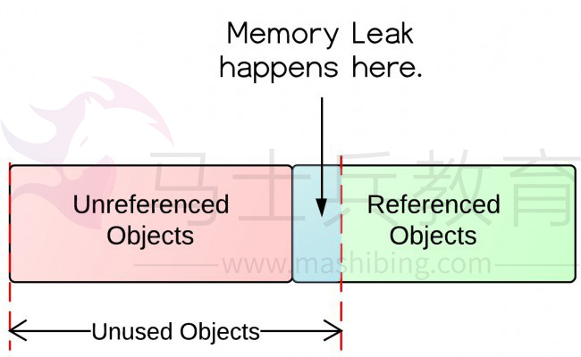
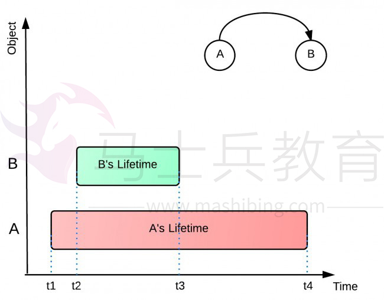

# 详解java内存泄露和如何避免内存泄漏

一直以来java都占据着语言排行榜的头把交椅。这是与java的设计密不可分的，其中最令大家喜欢的不是面向对象，而是垃圾回收机制。你只需要简单的创建对象而不需要负责释放空间，因为Java的垃圾回收器会负责内存的回收。然而，情况并不是这样简单，内存泄露还是经常会在Java应用程序中出现。
下面我们将详细的学习什么是内存泄露，为什么会发生，以及怎样阻止内存泄露。

什么是内存泄露

内存泄露的定义：对于应用程序来说，当对象已经不再被使用，但是Java的垃圾回收器不能回收它们的时候，就产生了内存泄露。
要理解这个定义，我们需要理解对象在内存中的状态。如下图所示，展示了哪些对象是无用对象，哪些是未被引用的对象；

上图中包含了未引用对象和引用对象。未引用对象将会被垃圾回收器回收，而引用对象却不会。未引用对象很显然是无用的对象。然而，无用的对象并不都是未引用对象，有一些无用对象也有可能是引用对象，这部分对象正是内存泄露的来源。

为什么内存泄露会发生

让我们用下面的例子来看看为什么会发生内存泄露。如下图所示，对象A引用对象B，A的生命周期（t1-t4）比B的生命周期（t2-t3）要长，当B在程序中不再被使用的时候，A仍然引用着B。在这种情况下，垃圾回收器是不会回收B对象的，这就可能造成了内存不足问题，因为A可能不止引用着B对象，还可能引用其它生命周期比A短的对象，这就造成了大量无用对象不能被回收，且占据了昂贵的内存资源。
同样的，B对象也可能引用着一大堆对象，这些被B对象引用着的对象也不能被垃圾回收器回收，所有的这些无用对象消耗了大量内存资源。

怎样阻止内存泄露

1.使用List、Map等集合时，在使用完成后赋值为null
2.使用大对象时，在用完后赋值为null
3.目前已知的jdk1.6的substring()方法会导致内存泄露
4.避免一些死循环等重复创建或对集合添加元素，撑爆内存
5.简洁数据结构、少用静态集合等
6.及时的关闭打开的文件，socket句柄等
7.多关注事件监听(listeners)和回调(callbacks)，比如注册了一个listener，当它不再被使用的时候，忘了注销该listener，可能就会产生内存泄露