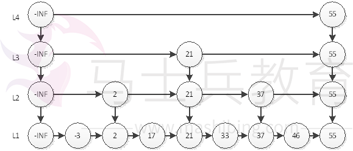
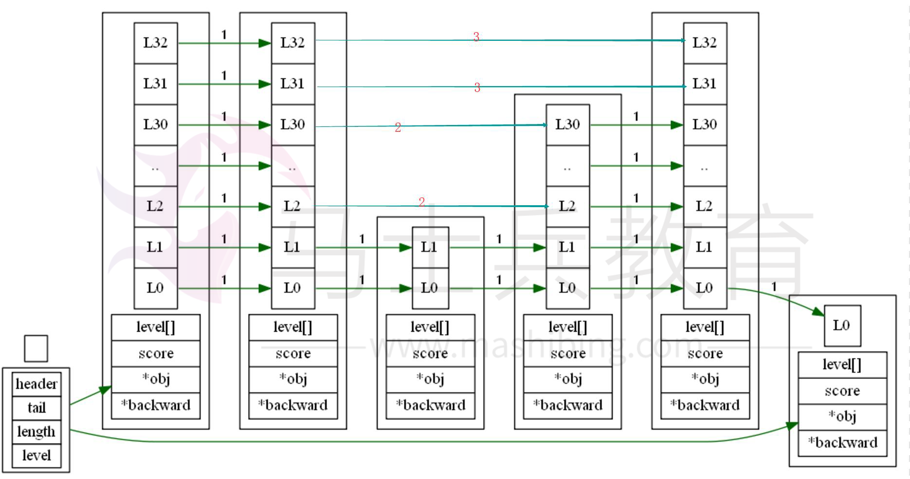
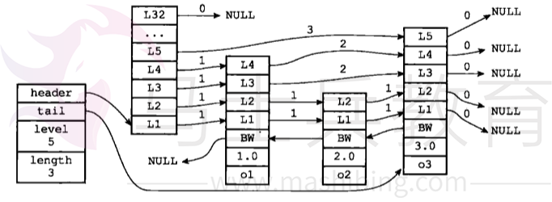
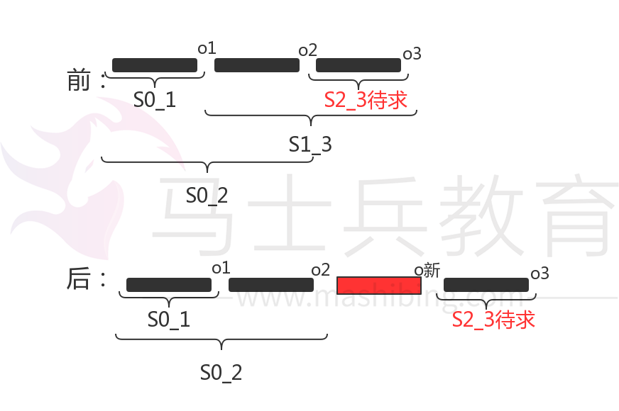

# 跳跃表以及跳跃表在redis中的实现

之前在阅读redis源码的时候了解到跳跃表这个数据结构，当时花了点时间了解了下，并做了记录；如今差不多一年过去了，被人问起，竟然一点印象都没有了。然后回头去看自己的注解，重新梳理下。

# 1 跳跃表的原理

跳跃表在redis中主要是有序表的一种底层实现。对于普通链表的查找，即使有序，我们也不能使用二分法，需要从头开始，一个一个找，时间复杂度为O(n)。而对于跳跃表，从名字可以看出跳跃表的优势就在于可以跳跃。如何做到呢？在于其特殊的层设计。比如我们查找46，普通链表只能从头开始查找，比对-3,2,17...直到46，要比对7次。但是对于跳跃表，我们可以从最高层开始查找：

第一步：在L4层直接与55比对，发现大了，退回到第3层

第二步：在L3层与21比对，发现小了，继续往前比对55，发现大了，退回到第二层

第三步：在L2层与37比对，发现小了，往前，与55比对，发现大了，退回到第一层

第四步：在第1层，与46比对，查找成功。

共比对了6次，比普通链表只节省了一次，似乎没什么优势。但如果细想，当链表比较长的时候，在高层查找时，跳过的元素数量将相当可观，提速的效果将非常明显。比如如果元素在55之后，在L4层，我们直接就跳过了7个元素，这是非常大的进步。



# 2 跳跃表在redis中的实现

## 2.1 跳跃表节点定义和跳跃表描述符定义




```
/* ZSETs use a specialized version of Skiplists */
typedef struct zskiplistNode {
	// member 对象
    robj *obj;
	// 分值
    double score;
	// 后退指针
    struct zskiplistNode *backward;
	// 层
    struct zskiplistLevel {
		// 前进指针
        struct zskiplistNode *forward;
		// 节点在该层和前向节点的距离
        unsigned int span;
    } level[];
} zskiplistNode;

typedef struct zskiplist {
	// 头节点，尾节点
    struct zskiplistNode *header, *tail;
	// 节点数量
    unsigned long length;
	// 目前表内节点的最大层数
    int level;
} zskiplist;
```

## 2.2 新建跳跃表

主要是初始化描述符对象和初始化头结点。这里需要注意的是，头结点默认层数是为32的，但描述符中指示跳跃表层数初始化为1。


```
/*****************************************************************************
 * 函 数 名  : zslCreate
 * 函数功能  : 创建新的跳跃表
 * 输入参数  : void   
 * 输出参数  : 无
 * 返 回 值  : zskiplist
 * 调用关系  : 
 * 记    录
 * 1.日    期: 2018年05月08日
 *   作    者:  
 *   修改内容: 新生成函数
*****************************************************************************/
zskiplist *zslCreate(void) {
    int j;
    zskiplist *zsl;

	// 申请内存
    zsl = zmalloc(sizeof(*zsl));
	// 初始化跳跃表属性,层数初始化为1，长度初始化为0
    zsl->level = 1;
    zsl->length = 0;
 
    // 创建一个层数为32，分值为0，成员对象为NULL的表头结点
    zsl->header = zslCreateNode(ZSKIPLIST_MAXLEVEL,0,NULL);
    for (j = 0; j < ZSKIPLIST_MAXLEVEL; j++) {
        
		// 设定每层的forward指针指向NULL
        zsl->header->level[j].forward = NULL;
        zsl->header->level[j].span = 0;
    }
	// 设定backward指向NULL
    zsl->header->backward = NULL;
    zsl->tail = NULL;
    return zsl;
} 
```


## 2.3 插入新节点

分为三步：

第一步，查找每一层的插入点，所谓插入点指新节点插入后作为新节点前继的节点

redis使用了一个数组来记录

```cpp
zskiplistNode *update[ZSKIPLIST_MAXLEVEL]
```

另外一个数组来记录插入点前继节点排名，所谓排名就是就链表中的位置，这个有什么用呢？主要是用来更新span字段

```cpp
  unsigned int rank[ZSKIPLIST_MAXLEVEL];
```

第二步，新建插入点，层数随机

这一步，要注意的是，如果新节点的层数大于跳跃表的层数，需要更新跳跃表的层数外，还要做：

1 将大于原跳跃表层数的更新节点设置为头结点

2 将大于原跳跃表层数的更新点前前继节点排名设置为0

3将更新点的前继节点设置为跳跃表长度，为啥是长度？因为整个层除了头结点没有其他节点

```cpp
 update[i]->level[i].span = zsl->length;
```

第三步，修改节点指针和跨度之span

**span**指示节点与后继节点的距离，如下图，o1.L1 和o2.L1距离为1，o1.L3 和o3.L3距离为2



插入新节点必然涉及到插入处前继和后继 节点指针的改，这个跟普通链表没有什么区别。至于span值的修改，因为在两个节点之间插入新节点，那么原来两点的距离就会产生改变，新节点与后继节点的跨度span也需要设置，这个怎么理解呢？

比如对于上图，要在o2和o3之间插入新节点，

update[0]=o2, rank[0]=2

update[1]=o2, rank[1]=2

update[2]=o1,rank[2]=1

update[3]=o1,rank[3]=1

update[4]=header,rank[1]=0

要设置新节点在L4层与后继节点的距离：

在L4层，在插入新节点之前，update[3]即o1的后继节点为o3，o1.level[3].span=2,插入后，新节点的后继节点为o3,怎么计算新节点在L4层的span呢？

**o新.level[3].span** 就是**o新**和**o3**的距离

我们知道的是插入新节点前：

1） **o1**和**o3**的距离（**o1.level[3].span**）,

2） **o1**和**o2**的排名（**rank[3]和\**\*\*rank[0]\*\**\***）

3）间接知道**o2**和**o1**的距离（**rank[0]-rank[3]**）

4）间接知道**o2**和**o3**的距离（**o1.level[3].span-（\**rank[0]-rank[3]）\****）

看图可知：插入节点后，**o新**和**o3**的距离，实质就是是插入节点前**o2**和**o3**的距离



下面是具体的源码实现：

```
/*****************************************************************************
 * 函 数 名  : zslInsert
 * 函数功能  : 插入新节点
 * 输入参数  : zskiplist *zsl  表头
               double score    节点分数
               robj *obj       待插入节点分数
 * 输出参数  : 无
 * 返 回 值  : zskiplistNode
 * 调用关系  : 
 * 记    录
 * 1.日    期: 2017年06月13日
 *   作    者: 
 *   修改内容: 新生成函数
*****************************************************************************/
zskiplistNode *zslInsert(zskiplist *zsl, double score, robj *obj) {
	// updata[]数组记录每一层位于插入节点的前一个节点
    zskiplistNode *update[ZSKIPLIST_MAXLEVEL], *x;

	// rank[]记录每一层位于插入节点的前一个节点的排名
	//在查找某个节点的过程中，将沿途访问过的所有层的跨度累计起来，得到的结果就是目标节点在跳跃表中的排位
    unsigned int rank[ZSKIPLIST_MAXLEVEL];

    int i, level;

    serverAssert(!isnan(score));
	// 表头节点
    x = zsl->header;

	// 从最高层开始查找(最高层节点少，跳越快)
    for (i = zsl->level-1; i >= 0; i--) {
        /* store rank that is crossed to reach the insert position */

        //rank[i]用来记录第i层达到插入位置的所跨越的节点总数,也就是该层最接近(小于)给定score的排名  
        //rank[i]初始化为上一层所跨越的节点总数,因为上一层已经加过
        rank[i] = i == (zsl->level-1) ? 0 : rank[i+1];
        
	    //后继节点不为空，并且后继节点的score比给定的score小  
        while (x->level[i].forward &&
            (x->level[i].forward->score < score ||
             	//score相同，但节点的obj比给定的obj小  
                (x->level[i].forward->score == score &&
                compareStringObjects(x->level[i].forward->obj,obj) < 0))) {
            //记录跨越了多少个节点  
            rank[i] += x->level[i].span;

			//查找下一个节点
            x = x->level[i].forward;
        }
		// 存储当前层上位于插入节点的前一个节点,找下一层的插入节点
        update[i] = x;
    }

    /* we assume the key is not already inside, since we allow duplicated
     * scores, and the re-insertion of score and redis object should never
     * happen since the caller of zslInsert() should test in the hash table
     * if the element is already inside or not. */

	// 此处假设插入节点的成员对象不存在于当前跳跃表内，即不存在重复的节点
    // 随机生成一个level值
    level = zslRandomLevel();
    
    
    
	// 如果level大于当前存储的最大level值
	// 设定rank数组中大于原level层以上的值为0--为什么设置为0
	// 同时设定update数组大于原level层以上的数据
    if (level > zsl->level) {

        for (i = zsl->level; i < level; i++) {

			//因为这一层没有节点，所以重置rank[i]为0
            rank[i] = 0;
			//因为这一层还没有节点，所以节点的前一个节点都是头节点
            update[i] = zsl->header;

			//在未添加新节点之前，需要更新的节点跨越的节点数目自然就是zsl->length---因为整个层只有一个头结点----->言外之意头结点的span都是链表长度
            update[i]->level[i].span = zsl->length;
        }
		// 更新level值（max层数）
        zsl->level = level;
    }

    // 创建插入节点
    x = zslCreateNode(level,score,obj);
    for (i = 0; i < level; i++) {

		// 针对跳跃表的每一层，改变其forward指针的指向
        x->level[i].forward = update[i]->level[i].forward;

		 //插入位置节点的后继就是新节点  
        update[i]->level[i].forward = x;

        /* update span covered by update[i] as x is inserted here */

		//rank[i]: 在第i层，update[i]->score的排名 
		//rank[0] - rank[i]: update[0]->score与update[i]->score之间间隔了几个数

		// A3 ----------------------------- [I] -> F3
		// A2 ----------------> D2 -------- [I] -> F2
		// A1 ---------> C1 --> D1 -------- [I] -> F1
		// A0 --> B0 --> C0 --> D0 --> E0 - [I] -> F0

        //x->level[i].span = 从x到update[i]->forword的span数目， 
		//原来的update[i]->level[i].span = 从update[i]到update[i]->level[i]->forward的span数目 
		//所以x->level[i].span = 原来的update[i]->level[i].span - (rank[0] - rank[i]); 
        x->level[i].span = update[i]->level[i].span - (rank[0] - rank[i]);


		//对于update[i]->level[i].span值的更新由于在update[i]与update[i]->level[i]->forward之间又添加了x， 
		//update[i]->level[i].span = 从update[i]到x的span数目， 
		//由于update[0]后面肯定是新添加的x，所以自然新的update[i]->level[i].span = (rank[0] - rank[i]) + 1; 

		//提示： update[i]和x[i]之间肯定没有节点了
        update[i]->level[i].span = (rank[0] - rank[i]) + 1;
    }


	//
	//另外需要注意当level > zsl->level时，update[i] = zsl->header的span处理 

    /* increment span for untouched levels */

	// 更新高层的span值
    for (i = level; i < zsl->level; i++) {
		//因为下层中间插入了x，而高层没有，所以多了一个跨度
        update[i]->level[i].span++;
    }

    // 设定插入节点的backward指针
	//如果插入节点的前一个节点都是头节点，则插入节点的后向指针为NULL？  
    x->backward = (update[0] == zsl->header) ? NULL : update[0];
    
	//如果插入节点的0层存前向节点则前向节点的后向指针为插入节点
    if (x->level[0].forward)
        x->level[0].forward->backward = x;
    else
	//否则该节点为跳跃表的尾节点
        zsl->tail = x;

	// 跳跃表长度+1
    zsl->length++;

    //返回插入的节点
    return x;
}
```

## 2.4 删除指定节点

删除节点相对简单一些，提供了根据排名删除节点和根据分数删除节点两个API，主要涉及如下步骤：

1）找到待删除节点在每一层的前继节点，存在updatte数组中

2）调用**zslDeleteNode**处理因为删除节点而引发的指针修改和span修改，以及跳跃表层数和长度修改

3）释放待删除节点

下面是源码的实现：

```
/* Delete all the elements with rank between start and end from the skiplist.
 * Start and end are inclusive. Note that start and end need to be 1-based */
/*****************************************************************************
 * 函 数 名  : zslDeleteRangeByRank
 * 函数功能  : 根据提供的排名起始和结尾删除节点
 * 输入参数  : zskiplist *zsl      跳跃表指针
               unsigned int start  排名起始
               unsigned int end    排名结尾
               dict *dict          ？
 * 输出参数  : 无
 * 返 回 值  : removed
 * 调用关系  : 
 * 记    录
 * 1.日    期: 2017年06月29日
 *   作    者: zyz
 *   修改内容: 新生成函数
*****************************************************************************/
unsigned long zslDeleteRangeByRank(zskiplist *zsl, unsigned int start, unsigned int end, dict *dict) {
    zskiplistNode *update[ZSKIPLIST_MAXLEVEL], *x;
    unsigned long traversed = 0, removed = 0;
    int i;

    x = zsl->header;
    //寻找待更新的节点
    for (i = zsl->level-1; i >= 0; i--) {
        //指针前移的必要条件是前继指针不为空
        while (x->level[i].forward && (traversed + x->level[i].span) < start) {
            //排名累加
            traversed += x->level[i].span;
            x = x->level[i].forward;
        }
        update[i] = x;
    }
 
    //下面的节点排名肯定大于等于start
    traversed++;
    x = x->level[0].forward;
    while (x && traversed <= end) {
        //逐个删除后继节点,直到end为止
        zskiplistNode *next = x->level[0].forward;
        zslDeleteNode(zsl,x,update);
        dictDelete(dict,x->obj);
        zslFreeNode(x);
        removed++;
        //每删除一个节点,排名加1
        traversed++;
        x = next;
    }
    return removed;
}

/* Internal function used by zslDelete, zslDeleteByScore and zslDeleteByRank */
/*****************************************************************************
 * 函 数 名  : zslDeleteNode
 * 函数功能  : 内置功能函数，被zslDelete等函数调用
 * 输入参数  : zskiplist *zsl          链表头指针
               zskiplistNode *x        待删除节点指针
               zskiplistNode **update  带删除节点的前一节点地址的指针
 * 输出参数  : 无
 * 返 回 值  : 
 * 调用关系  : 
 * 记    录
 * 1.日    期: 2017年06月24日
 *   作    者: 
 *   修改内容: 新生成函数
*****************************************************************************/

void zslDeleteNode(zskiplist *zsl, zskiplistNode *x, zskiplistNode **update) {
    int i;
    for (i = 0; i < zsl->level; i++) {
        //如果待更新节点（待删除节点的前一节点）的后继节点是待删除节点，则需要处理待更新节点的后继指针
        if (update[i]->level[i].forward == x) {
            update[i]->level[i].span += x->level[i].span - 1;
      
            //这里有可能为NULL，比如删除最后一个节点
            update[i]->level[i].forward = x->level[i].forward;
 

        //待删除节点没有出现在此层--跨度减1即可
        } else {
            update[i]->level[i].span -= 1;
        }
    }
    //处理待删除节点的后一节点（如果存在的话）
    if (x->level[0].forward) {
        x->level[0].forward->backward = x->backward;
    } else {
        zsl->tail = x->backward;
    }
    //跳跃表的层数处理，如果表头层级的前向指针为空，说明这一层已经没有元素，层数要减一
    while(zsl->level > 1 && zsl->header->level[zsl->level-1].forward == NULL)
        zsl->level--;
    
    //跳跃表长度减一
    zsl->length--;
}
 
/*****************************************************************************
 * 函 数 名  : zslDelete
 * 函数功能  : 根据给定分值和成员来删除节点
 * 输入参数  : zskiplist *zsl  表头指针
               double score    节点分数
               robj *obj       节点数据指针
 * 输出参数  : 无
 * 返 回 值  : 
 * 调用关系  : 
 * 记    录
 * 1.日    期: 2017年06月13日
 *   作    者: zyz
 *   修改内容: 新生成函数

*****************************************************************************/
int zslDelete(zskiplist *zsl, double score, robj *obj) {
    zskiplistNode *update[ZSKIPLIST_MAXLEVEL], *x;
    int i;
 
    x = zsl->header;
    // 遍历所有层，记录删除节点后需要被修改的节点到 update 数组  
    for (i = zsl->level-1; i >= 0; i--) {
        //指针前移首要条件是前向节点指针不为空，次要条件是分数小于指定分数，或即使分数相等，节点成员对象也不相等------> 前向指针前移的必要条件：分数小于或等于指定分数
        while (x->level[i].forward && //前向指针不为空
            (x->level[i].forward->score < score || //前向节点分数小于指定分数
                (x->level[i].forward->score == score &&  //前向节点分数等于指定分数
                compareStringObjects(x->level[i].forward->obj,obj) < 0)))//前向节点成员对象不相同
            x = x->level[i].forward;
        //保存待删除节点的前一节点指针
        update[i] = x;
    }
    // 因为多个不同的 member 可能有相同的 score  
    // 所以要确保 x 的 member 和 score 都匹配时，才进行删除  
 
    x = x->level[0].forward;
 
    if (x && score == x->score && equalStringObjects(x->obj,obj)) {
        zslDeleteNode(zsl, x, update);
        zslFreeNode(x);
        return 1;
    }
    return 0; /* not found */
}
```

## 2.5 跳跃表的查询

跳跃表提供了根据排名查询元素，以及根据分数或群排名的API，间接提供了根据分数获取元素的API，查询体现了跳跃表的优势，但实现相对简单，主要是判断在当前层比对的元素是否是否小于给定元素，如果小于，且其后继指针不为空，则继续往前查找（这效率是很高的），否则往下一层找（效率相对低一点）：

```
 /* Find the rank for an element by both score and key.
 * Returns 0 when the element cannot be found, rank otherwise.
 * Note that the rank is 1-based due to the span of zsl->header to the
 * first element. */
/*****************************************************************************
 * 函 数 名  : zslGetRank
 * 函数功能  : 获取指定分数和成员数据对象确定节点的排名
 * 输入参数  : zskiplist *zsl  跳跃表指针
               double score    节点分数
               robj *o         成员数据对象指针
 * 输出参数  : 无
 * 返 回 值  : unsigned
 * 调用关系  : 
 * 记    录
 * 1.日    期: 2017年06月29日
 *   作    者: zyz
 *   修改内容: 新生成函数
*****************************************************************************/
unsigned long zslGetRank(zskiplist *zsl, double score, robj *o) {
    zskiplistNode *x;
    unsigned long rank = 0;
    int i;
 
    x = zsl->header;
    for (i = zsl->level-1; i >= 0; i--) {
        //指针前移的必要条件是后继指针不为空
        while (x->level[i].forward &&
            (x->level[i].forward->score < score ||
                (x->level[i].forward->score == score &&
                compareStringObjects(x->level[i].forward->obj,o) <= 0))) {
            rank += x->level[i].span;
            //排名累加
            x = x->level[i].forward;
        }
 
        /* x might be equal to zsl->header, so test if obj is non-NULL */
        if (x->obj && equalStringObjects(x->obj,o)) {
            return rank;
        }
    }
    return 0;
}
 
/* Finds an element by its rank. The rank argument needs to be 1-based. */
/*****************************************************************************
 * 函 数 名  : zslGetElementByRank
 * 函数功能  : 根据排名获取跳跃表元素
 * 输入参数  : zskiplist *zsl      跳跃表描述结构指针
               unsigned long rank  排名
 * 输出参数  : 无
 * 返 回 值  : 
 * 调用关系  : 
 * 记    录
 * 1.日    期: 2018年05月10日
 *   作    者:  
 *   修改内容: 新生成函数
*****************************************************************************/
zskiplistNode* zslGetElementByRank(zskiplist *zsl, unsigned long rank) {
    zskiplistNode *x;
    unsigned long traversed = 0;
    int i;
 
    x = zsl->header;
    for (i = zsl->level-1; i >= 0; i--) {
        while (x->level[i].forward && (traversed + x->level[i].span) <= rank)
        {
            traversed += x->level[i].span;
            x = x->level[i].forward;
        }
        if (traversed == rank) {
            return x;
        }
    }
    return NULL;
}
```


总结：redis为了能根据排名查询元素，在每一个层维护了一个span字段，相对来说增加了不少实现的复杂度，在我看来是得不偿失的，不知道redis的在这个上面还有其他奥妙没有，或许我没有发现。