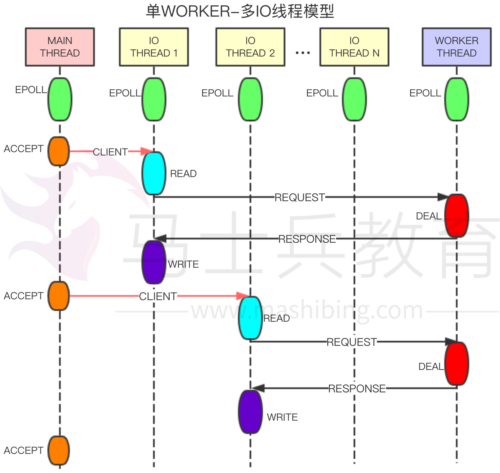
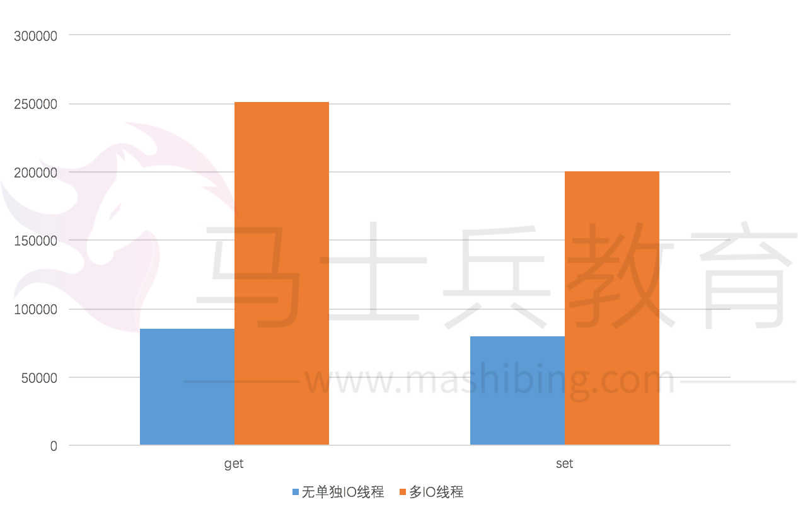

# 阿里云Redis多线程性能提升思路解析 

背景

众所周知redis是单进程单线程模型（不完全是单进程单线程，还有若干后端线程主要做刷脏数据，关闭文件描述符等后台清理工作）。redis中负责主要工作的是主线程，主线程的工作包括但不限：接收客户端连接，处理连接读写事件，解析请求，处理命令，处理定时器事件,数据同步等相关工作。单进程单线程只能跑满一个CPU核，在小包场景下，单个redis server的QPS在8~10万级别。如果QPS超过这个级别，单个redis server就无法满足需求。而常用的解决办法就是数据分片，采用多server的分布式架构予以解决。然而数据分片，多redis server方式也存在若干问题：redis server过多，难以管理；分片之后一些在单redis server上使用的命令无法支持；分片无法解决热点读写问题;分片后数据倾斜，数据重分布，数据扩缩容等也比较复杂。由于单进程单线程的局限，我们期望通过多线程的改造以期充分利用SMP多核架构的优势，从而达到提高单redis server吞吐的目的。对redis做多线程化，最容易想到的方案是每个线程既做IO又做命令处理等工作，但由于redis处理的数据结构相对比较复杂，多线程需要锁来保证线程安全性，而锁粒度处理不好性能反而可能会出现下降。

我们的思路是通过增加IO线程，将连接中数据的读写，命令的解析和数据包的回复放到单独的IO线程来处理，而对命令的处理，定时器事件的执行等仍让单一的线程来处理，以此达到提高单redis server吞吐的目的。

单进程单线程的优点和不足

优点

- 因为单进程单线程模型的限制，redis在实现上将耗时的操作分解成多步，多次来执行（例如dict rehash， 过期key删除等操作），尽量避免长时间执行一个操作，从而避免长时间阻塞在一个操作上。单进程单线程代码编写简单，可以减少多进程多线程导致的上下文切换和锁的争抢。

不足

- 只能使用一个CPU核，无法发挥多核优势。
- 对于重IO应用来说，大量的cpu耗费在网络IO操作上。对于将redis做为缓存的应用，往往都是重IO的应用。这类应用基本上都是QPS很高，使用的命令相对比较简单（多为get，set，incr等操作），但是对RT响应很敏感。这类应用通常带宽占用很高，甚至会跑到百兆级别。当前由于万兆，25G网卡的普及，网络往往已不再是瓶颈，而如何发挥多核优势，充分发挥网卡性能成为需要考虑的事情。

实现

线程划分

- 主线程(MAIN THREAD)
- IO线程(IO THREAD)
- WORKER线程(WORKER THREAD)

线程模型

- 主线程：接受连接，创建client，将连接转发给IO线程。
- IO线程：处理连接的读写事件，解析命令，将解析的完整命令转发给WORKER线程处理，发送response包，负责删除连接等。
- WORKER线程：负责命令的处理，生成客户端回包，定时器事件的执行等。
- 主线程，IO线程，WORKER线程都有单独的事件驱动。
- 线程之间通过无锁队列交换数据，通过管道进行消息通知。

收益

压测结果

- 从压测结果来看，小包场景下，读写性能差不多有三倍左右的性能提升。

主从同步速度提升

主从同步优化

- Master向Slave发送同步数据时，数据在IO线程中发送，Slave从主读取数据时，全量数据在WORKER线程中读取，增量数据在IO线程中读取，因此可以相对比较有效的增加同步的速度。

后续工作

- 现在所做的第一部分工作是增加IO线程，优化IO读写能力。进一步的优化可以考虑对WORKER线程进行拆分：每个线程既负责IO读取，也负责WORKER工作处理。

IO线程数设置

- 从测试结果来看，IO线程数最大不要超过6个。超过之后对简单操作来说，WORKER线程往往已经成为瓶颈。
- 进程在启动时需要设置IO线程的个数，在进程运行期间IO线程个数无法修改,按当前的连接分配策略，修改IO线程的个数涉及到连接的重新分配，处理相对比较复杂。

展望

- 随着万兆网卡，25G网卡的普及，如何充分利用硬件的性能需要充分的考虑。多网络IO线程，By pass内核的用户态协议栈等都是可利用的技术。
- 通过IO线程实现数据的迁移，可以无阻塞，IO线程对数据进程Encode，或者命令转发，目标节点实现数据Decode，或者命令执行。