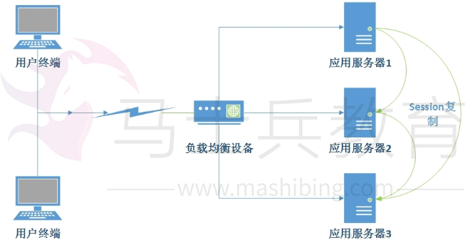
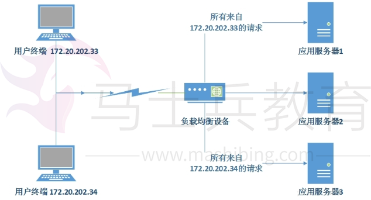
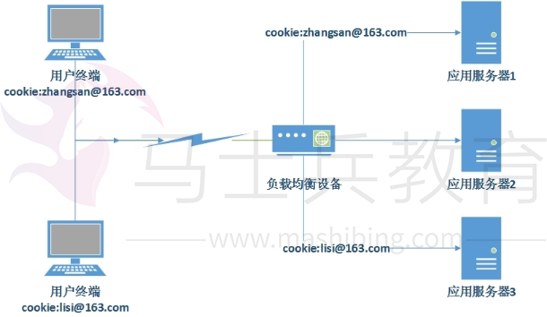
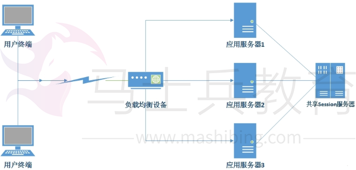

# 集群服务器Session同步

事实上，网站总是有状态的。每一个登录信息、用户信息常常被存储在session内部。而当一个网站被部署在不止一台服务器的时候，就会遇到session同步的问题。事实上即使一个很小的网站，也要至少有两台服务器互为备份，分单流量是必须得，更重要的是无缝切流量升级。为了保证服务的不间断又要进行网站的维护升级，切流量是最简单的。那么如何保证切流量的时候session也会跟着同步过去呢？在集群环境下，大致有以下几种手段：

**一、Session复制**

  这是一种在早期应用系统中使用较多的服务器session管理方式。应用服务器开启Web容器的session的复制功能，在集群中的几台服务器之间同步session对象，这样一台服务器宕机不会导致session数据丢失。即每一台服务器都持有集群中所有的session，每次访问仅从本机获取就可以了。其工作形式如下所示：

  从session复制的几条线就可以看出，这种方式仅适用用小型集群。当服务集群规模很大时，集群服务器间的复制就需要大量的通讯，占用大量网络资源，甚至会出现内存不够的情况。

**二、Session绑定**

  Session绑定可以利用负载均衡的源地址Hash算法实现，负载均衡服务器总是将来自同一个IP地址的访问分发到同一台服务器上。这样整个会话期间，用户所有的请求都来自一台服务器，保证了Session总是从这台服务器获取。其工作形式如下图所示：

但是这样的系统显然不符合我们对系统的需求。如果一台服务器宕机，那么其处理的所有请求Session会话全部丢失，用户因为切换服务器后没有Session而导致无法完成业务。

**三、利用Cookie记录Session**

  这种管理方式将Session记录在客户端，每次请求服务器的时候，将Session放在请求中发送给服务器，服务器处理完成后再将修改后的Session响应给客户端。

  利用Cookie记录当然也有缺点，比如Cookie大小限制，能记录的信息也有限，因为很多时候我们在Session中储存的也并非String类型的记录。每次请求都需要传输Cookie，影响性能；另外如果用户关闭Cookie功能就不能用了。但是这种方式因此高可用性、支持服务器的线性伸缩，许多网站都在使用这种方式。我的学校网站也应用了这种技术。

**四、Session服务器**

  如果有这样一个服务器，可用性高、伸缩性好、性能也不错，对信息大小又没有限制，那它就是Session服务器。利用独立部署的Session服务器统一管理Session，应用服务器每次读写Session时，都访问Session服务器。其工作形式如下所示：

这种方式实际上是将应用服务器的状态分离，分为无状态的应用服务器和有状态的Session服务器，然后针对这两种服务器的不同特性分别设计其架构。

对于有状态的Session服务器，一种比较简单的方式是利用分布式缓存、数据库等。