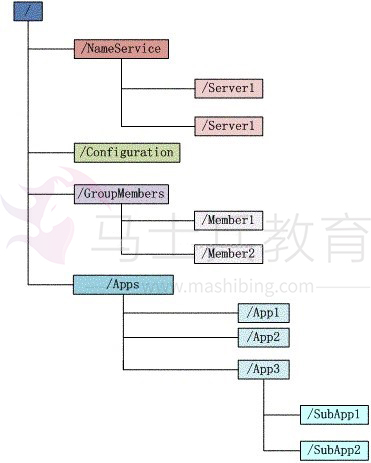
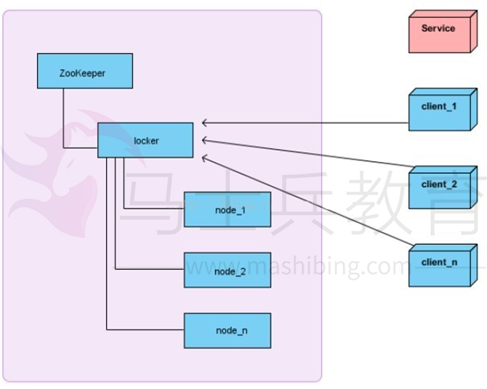
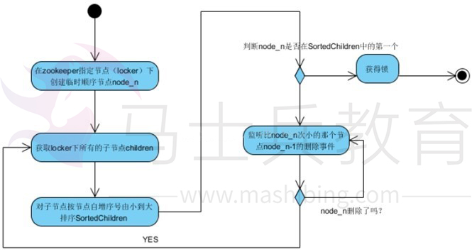

# 1.ZooKeeper 是什么？ 

ZooKeeper 是一个***分布式\***的，开放源码的分布式***应用程序协调服务\***，是 Google 的 Chubby 一个开源的实现，它是***集群的管理者\***，***监视着集群中各个节点的状态根据节点提交的反馈进行下一步合理操作\***。最终，将简单易用的接口和性能高效、功能稳定的系统提供给用户。 

客户端的***读请求\***可以被集群中的***任意一台机器处理\***，如果读请求在节点上注册了监听器，这个监听器也是由所

连接的 zookeeper 机器来处理。对于***写请求\***，这些请求会同***时发给其他zookeeper机器并且达成一致后，请求才会返回成功\***。因此，随着***zookeeper\******的集群机器增多，读请求的吞吐会提高但是写请求的吞吐会下降\***。有序性是 zookeeper 中非常重要的一个特性，所有的***更新都是全局有序的\***，每个更新都有一个***唯一的时间戳\***，这个时间戳称为***zxid\******（Zookeeper Transaction Id）\***。而***读请求只会相对于更新有序\***，也就是读请求的返回结果中会带有这个***zookeeper\******最新的zxid\***。 

# 2.ZooKeeper 提供了什么？ 

1、  ***文件系统\*** 

2、  ***通知机制\*** 

# 3.Zookeeper 文件系统 

Zookeeper 提供一个多层级的节点命名空间（节点称为 znode）。与文件系统不同的是，这些节点***都可以设置关联的数据\***，而文件系统中只有文件节点可以存放数据而目录节点不行。Zookeeper 为了保证高吞吐和低延

迟，在内存中维护了这个树状的目录结构，这种特性使得 Zookeeper***不能用于存放大量的数据\***，每个节点的存放数据上限为***1M\***。 

# 4.四种类型的 znode 

1、  ***PERSISTENT-\******持久化目录节点\*** 

客户端与 zookeeper 断开连接后，该节点依旧存在  

2、  ***PERSISTENT_SEQUENTIAL-\******持久化顺序编号目录节点\*** 

客户端与 zookeeper 断开连接后，该节点依旧存在，只是 Zookeeper 给该节点名称进行顺序编号  

3、  ***EPHEMERAL-\******临时目录节点\*** 

客户端与 zookeeper 断开连接后，该节点被删除  

4、  ***EPHEMERAL_SEQUENTIAL-\******临时顺序编号目录节点\*** 

客户端与 zookeeper 断开连接后，该节点被删除，只是 Zookeeper 给该节点名称进行顺序编号 

# 5.Zookeeper 通知机制 

client 端会对某个 znode 建立一个***watcher\******事件\***，当该 znode 发生变化时，这些 client 会收到 zk 的通知，然后 client 可以根据 znode 变化来做出业务上的改变等。 

# 6.Zookeeper 做了什么？ 

1、命名服务

2、配置管理

3、集群管理

4、分布式锁

5、队列管理

# 7.zk 的命名服务（文件系统） 

命名服务是指通过指定的名字来***获取资源\***或者***服务的地址\***，利用 zk 创建一个全局的路径，即是***唯一\***的路径，这个路径就可以作为一个名字，指向集群中的集群，提供的服务的地址，或者一个远程的对象等等。 

# 8.zk 的配置管理（文件系统、通知机制） 

程序分布式的部署在不同的机器上，将程序的配置信息放在 zk 的***znode\***下，当有配置发生改变时，也就是

znode 发生变化时，可以通过改变 zk 中某个目录节点的内容，利用***watcher\***通知给各个客户端，从而更改配置。 

# 9.Zookeeper 集群管理（文件系统、通知机制） 

所谓集群管理无在乎两点：***是否有机器退出和加入、选举master\***。 

对于第一点，所有机器约定在父目录下***创建临时目录节点\***，然后监听父目录节点的子节点变化消息。一旦有机

器挂掉，该机器与 zookeeper 的连接断开，其所创建的临时目录节点被删除，***所有其他机器都收到通知：某个兄弟目录被删除\***，于是，所有人都知道：它上船了。 

新机器加入也是类似，***所有机器收到通知：新兄弟目录加入\***，highcount 又有了，对于第二点，我们稍微改变一下，***所有机器创建临时顺序编号目录节点，每次选取编号最小的机器作为master就好\***。 

# 10.Zookeeper 分布式锁（文件系统、通知机制） 

有了 zookeeper 的一致性文件系统，锁的问题变得容易。锁服务可以分为两类，一个是***保持独占\***，另一个是***控制时序\***。 

对于第一类，我们将 zookeeper 上的一个***znode\******看作是一把锁\***，通过 createznode 的方式来实现。所有客户

端都去创建 /distribute_lock 节点，最终成功创建的那个客户端也即拥有了这把锁。用完删除掉自己创建的 distribute_lock 节点就释放出锁。  

对于第二类， /distribute_lock 已经预先存在，所有客户端在它下面创建临时顺序编号目录节点，和选 master 一样，***编号最小的获得锁\***，用完删除，依次方便。 

# 11.获取分布式锁的流程

在获取分布式锁的时候在 locker 节点下创建临时顺序节点，释放锁的时候删除该临时节点。客户端调用 createNode 方法在 locker 下创建临时顺序节点， 

然后调用 getChildren(“locker”)来获取 locker 下面的所有子节点，注意此时不用设置任何 Watcher。客户端获取到所有的子节点 path 之后，如果发现自己创建的节点在所有创建的子节点序号最小，那么就认为该客户端获取到了锁。如果发现自己创建的节点并非 locker 所有子节点中最小的，说明自己还没有获取到锁，此时客户端需要找到***比自己小的那个节点\***，然后对其调用***exist()\***方法，同时对其注册事件监听器。之后，让这个被关注的节点删除，则客户端的 Watcher 会收到相应通知，此时再次判断自己创建的节点是否是 locker 子节点中序号最小的，如果是则获取到了锁，如果不是则重复以上步骤继续获取到比自己小的一个节点并注册监听。当前这个过程中还需要许多的逻辑判断。 

代码的实现主要是基于互斥锁，获取分布式锁的重点逻辑在于***BaseDistributedLock\***，实现了基于Zookeeper 实现分布式锁的细节。 

# 12.Zookeeper 队列管理（文件系统、通知机制） 

两种类型的队列： 

1、同步队列，当一个队列的成员都聚齐时，这个队列才可用，否则一直等待所有成员到达。 

2、队列按照 FIFO 方式进行入队和出队操作。 

第一类，在约定目录下创建临时目录节点，监听节点数目是否是我们要求的数目。  

第二类，和分布式锁服务中的控制时序场景基本原理一致，入列有编号，出列按编号。在特定的目录下创建

***PERSISTENT_SEQUENTIAL\***节点，创建成功时***Watcher\***通知等待的队列，队列删除***序列号最小的节点\***用以消费。此场景下 Zookeeper 的 znode 用于消息存储，znode 存储的数据就是消息队列中的消息内容，

SEQUENTIAL 序列号就是消息的编号，按序取出即可。由于创建的节点是持久化的，所以***不必担心队列消息的丢失问题\***。 

# 13.Zookeeper 数据复制 

Zookeeper 作为一个集群提供一致的数据服务，自然，它要在***所有机器间\***做数据复制。数据复制的好处： 

1、容错：一个节点出错，不致于让整个系统停止工作，别的节点可以接管它的工作； 

2、提高系统的扩展能力 ：把负载分布到多个节点上，或者增加节点来提高系统的负载能力； 

3、提高性能：让***客户端本地访问就近的节点，提高用户访问速度\***。 

从客户端读写访问的透明度来看，数据复制集群系统分下面两种：  

1、  ***写主\***(WriteMaster) ：对数据的***修改提交给指定的节点\***。读无此限制，可以读取任何一个节点。这种情况下客户端需要对读与写进行区别，俗称***读写分离\***； 

2、  ***写任意\***(Write Any)：对数据的***修改可提交给任意的节点\***，跟读一样。这种情况下，客户端对集群节点的角色与变化透明。 

对 zookeeper 来说，它采用的方式是***写任意\***。通过增加机器，它的读吞吐能力和响应能力扩展性非常好，而写，随着机器的增多吞吐能力肯定下降（这也是它建立 observer 的原因），而响应能力则取决于具体实现方式，是***延迟复制保持最终一致性\***，还是***立即复制快速响应\***。 

# 14.Zookeeper 工作原理 

Zookeeper 的核心是***原子广播\***，这个机制保证了***各个Server之间的同步\***。实现这个机制的协议叫做***Zab\******协议\***。Zab 协议有两种模式，它们分别是***恢复模式（选主）\***和***广播模式（同步）\***。当服务启动或者在领导者崩溃后，Zab 就进入了恢复模式，当领导者被选举出来，且大多数 Server 完成了和 leader 的状态同步以后，恢复模式就结束了。状态同步保证了 leader 和 Server 具有相同的系统状态。 

# 15.zookeeper 是如何保证事务的顺序一致性的？ 

zookeeper 采用了***递增的事务Id\***来标识，所有的 proposal（提议）都在被提出的时候加上了 zxid，zxid 实际上是一个 64 位的数字，高 32 位是 epoch（时期; 纪元; 世; 新时代）用来标识 leader 是否发生改变，如果有新的 leader 产生出来，epoch 会自增，***低32位用来递增计数\***。当新产生 proposal 的时候，会依据数据库的两阶段过程，首先会向其他的 server 发出事务执行请求，如果超过半数的机器都能执行并且能够成功，那么就会开始执行。 

# 16.Zookeeper 下 Server 工作状态 

每个 Server 在工作过程中有三种状态：  

LOOKING：当前 Server***不知道leader是谁\***，正在搜寻 

LEADING：当前 Server 即为选举出来的 leader 

FOLLOWING：leader 已经选举出来，当前 Server 与之同步 

# 17.zookeeper 是如何选取主 leader 的？ 

当 leader 崩溃或者 leader 失去大多数的 follower，这时 zk 进入恢复模式，恢复模式需要重新选举出一个新的 leader，让所有的 Server 都恢复到一个正确的状态。Zk 的选举算法有两种：一种是基于 basic paxos 实现的，另外一种是基于 fast paxos 算法实现的。系统默认的选举算法为***fast paxos\***。 

1、Zookeeper 选主流程(basic paxos) 

（1）    选举线程由当前 Server 发起选举的线程担任，其主要功能是对投票结果进行统计，并选出推荐的Server；  

（2）    选举线程首先向所有 Server 发起一次询问(包括自己)；  

（3）    选举线程收到回复后，验证是否是自己发起的询问(验证 zxid 是否一致)，然后获取对方的 id(myid)，并存储到当前询问对象列表中，最后获取对方提议的 leader 相关信息(id,zxid)，并将这些信息存储到当次选举的投票记录表中；  

（4）    收到所有 Server 回复以后，就计算出 zxid 最大的那个 Server，并将这个 Server 相关信息设置成下一次要投票的 Server；  

（5）    线程将当前 zxid 最大的 Server 设置为当前 Server 要推荐的 Leader，如果此时获胜的 Server 获得 n/2 \+ 1 的 Server 票数，设置当前推荐的 leader 为获胜的 Server，将根据获胜的 Server 相关信息设置自己的状态，否则，继续这个过程，直到 leader 被选举出来。 通过流程分析我们可以得出：要使 Leader 获得多数Server 的支持，则 Server 总数必须是奇数 2n+1，且存活的 Server 的数目不得少于 n+1. 每个 Server 启动后都会重复以上流程。在恢复模式下，如果是刚从崩溃状态恢复的或者刚启动的 server 还会从磁盘快照中恢复数据和会话信息，zk 会记录事务日志并定期进行快照，方便在恢复时进行状态恢复。 