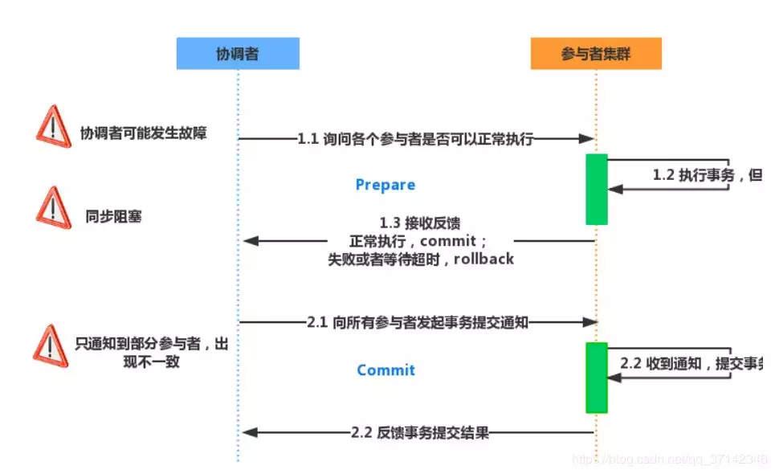
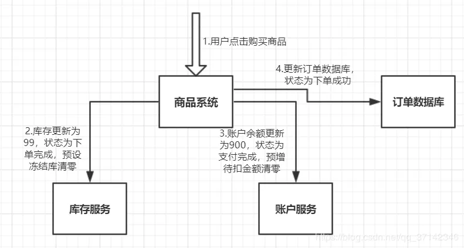
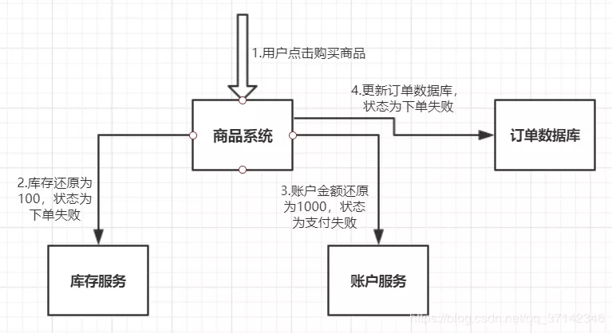
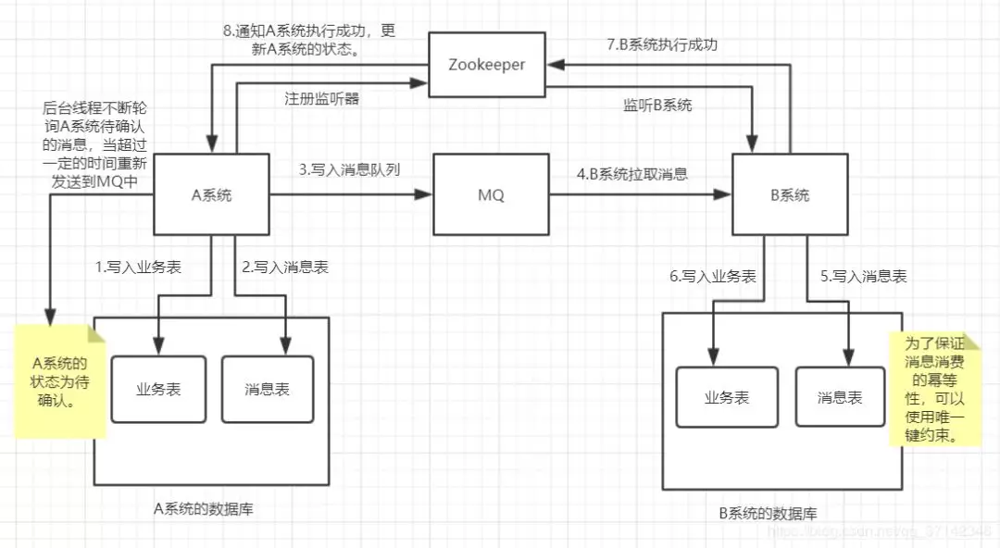
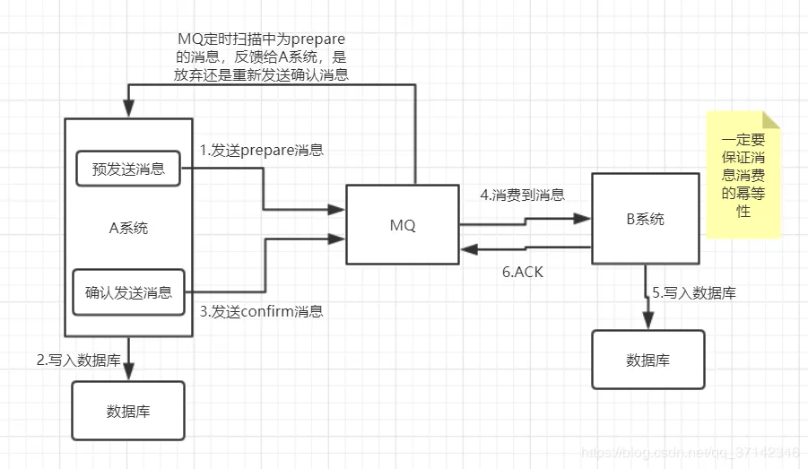
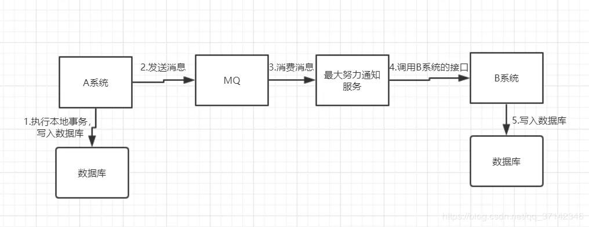

# 6种最常见分布式事务解决方案

分布式事务就是指事务的参与者、支持事务的服务器、资源服务器以及事务管理器分别位于不同的分布式系统的不同节点之上。以上是百度百科的解释，简单的说，就是一次大的操作由不同的小操作组成，这些小的操作分布在不同的服务器上，且属于不同的应用，分布式事务需要保证这些小操作要么全部成功，要么全部失败。本质上来说，分布式事务就是为了保证不同数据库的数据一致性。

以商品流水账单为例，我们拆分为商品购买系统，订单系统，支付系统。

用户看中一件商品，点击购买。

商品购买系统响应用户的点击，向订单系统插入一条订单信息。

跳转到支付系统完成支付。

在用户整个购买商品的过程中，我们需要保证事件1，2，3在没有异常的情况下全部执行成功，一旦某个系统抛出异常，都需要回滚。

那么，如何保证各个子系统的操作具有一致性呢？这就是我们下面提到的分布式事务的解决方案。

在这里，文章中没有提到分布式一致性协议，下面简单列举一下，有兴趣的读者可以参考其他详细资料：

两阶段提交协议

三阶段提交协议

Paxos协议

Raft协议

二、分布式事务的解决方案

**1.两阶段提交方案/XA方案**

该方案基于两阶段提交协议，因此也叫做两阶段提交方案。在该分布式系统中，其中 需要一个系统担任协调器的角色，其他系统担任参与者的角色。主要分为Commit-request阶段和Commit阶段

请求阶段：首先协调器会向所有的参与者发送准备提交或者取消提交的请求，然后会收集参与者的决策。

提交阶段：协调者会收集所有参与者的决策信息，当且仅当所有的参与者向协调器发送确认消息时协调器才会提交请求，否则执行回滚或者取消请求。

该方案的缺陷：

同步阻塞：所有的参与者都是事务同步阻塞型的。当参与者占有公共资源时，其他第三方节点访问公共资源不得不处于阻塞状态。

单点故障：一旦协调器发生故障，系统不可用。

数据不一致：当协调器发送commit之后，有的参与者收到commit消息，事务执行成功，有的没有收到，处于阻塞状态，这段时间会产生数据不一致性。

不确定性：当协调器发送commit之后，并且此时只有一个参与者收到了commit，那么当该参与者与协调器同时宕机之后，重新选举的协调器无法确定该条消息是否提交成功。

XA方案的实现方式可以使用Spring+JTA来实现，可以参考文章：Springboot+atomikos+jta实现分布式事务统一管理

**2.TCC方案**

TCC方案分为Try Confirm Cancel三个阶段，属于补偿性分布式事务。

Try：尝试待执行的业务

这个过程并未执行业务，只是完成所有业务的一致性检查，并预留好执行所需的全部资源

Confirm：执行业务

这个过程真正开始执行业务，由于Try阶段已经完成了一致性检查，因此本过程直接执行，而不做任何检查。并且在执行的过程中，会使用到Try阶段预留的业务资源。

Cancel：取消执行的业务

若业务执行失败，则进入Cancel阶段，它会释放所有占用的业务资源，并回滚Confirm阶段执行的操作。

以一个电商系统用户购买商品的流水线为例。

Try阶段：

在Try阶段成功之后进入Confirm阶段，如有任何异常，进入Cancel阶段。

Confirm阶段

Cancel阶段

假设库存扣减失败，此时需要回滚取消事务。

TCC方案适用于一致性要求极高的系统中，比如金钱交易相关的系统中，不过可以看出，其基于补偿的原理，因此，需要编写大量的补偿事务的代码，比较冗余。不过现有开源的TCC框架，比如TCC-transaction。

**3. 本地消息表**

本地消息表分布式事务解决方案是国外的eBay提出的一套方案。

需要注意的是，该方案中，在A系统中，我们首先写入业务表，然后写入消息表，然后将消息发送到MQ中，在B系统中需要先写入消息表，这是为了保证消息重复消费，为了保证消息消费的幂等性，我们可以使用数据的唯一键来约束。

当B系统执行成功之后，需要通知A系统执行成功，此时可以使用一个监听器，如Zookeeper，ZK监听到执行成功更新A系统成功。然后开始发送下一条消息。

A系统中需要有一个后台线程，不断的去判断A系统的状态为待确认的消息，设置超时机制，如果超时，重新发送到MQ中。直到执行成功。

可以看出，本地消息表方案需要写入消息表中，如果在高并发的场景下会进行大量的磁盘IO，因此该方案不适用于高并发场景。

**4.可靠消息最终一致性方案**

该方案基于本地消息表进行优化，不使用本地消息表，而是基于MQ，比如阿里的RocketMQ就支持消息事务。

在该方案中，首先A系统需要向MQ中发送prepare消息，然后执行A系统的业务，写入数据库成功之后向MQ发送confirm消息，当消息为confirm状态时，B系统就可以消费到消息，消费成功之后返回ACK确认消息给MQ。

需要注意的是。需要保证B系统消费消息的幂等性，可以借助第三方系统。比如在redis中设置标识，标明已经消费过该消息，或者借助ZK基于分布式锁的原理，创建节点，重复消费消息，创建失败。

**5.最大努力通知方案**

最大努力通知型( Best-effort delivery)是最简单的一种柔性事务，适用于一些最终一致性时间敏感度低的业务，且被动方处理结果 不影响主动方的处理结果。典型的使用场景：如银行通知、商户通知等。

在该系统中，A系统执行完本地事务，向MQ发送消息，最大努力通知服务消费消息，比如消息服务，然后调用B系统的接口，执行B系统的本地事务，如果B系统执行成功则OK，否则不断重试，重复多次之后还是失败的话就放弃执行。