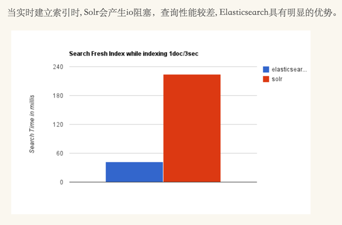
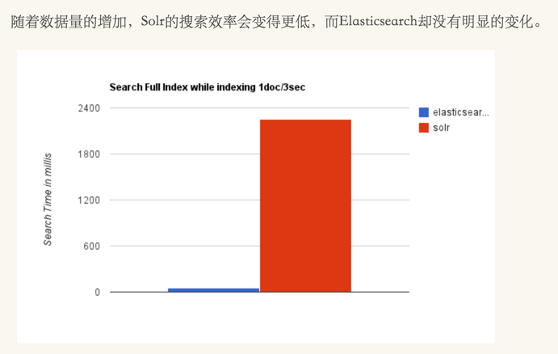

# ElasticSearch（ES）和solr的关系和区别

Solr 2004年诞生（当时是Solar）。

ElasticSearch 2010年诞生。

ES更加新。

下面文字有误，其实是在不断动态添加。

综上所述，Solr的架构不适合实时搜索的应用。

 

## Elasticsearch 与 Solr 的比较总结

- 二者安装都很简单；
- Solr 利用 Zookeeper 进行分布式管理，而 Elasticsearch 自身带有分布式协调管理功能;
- Solr 支持更多格式的数据，而 Elasticsearch 仅支持json文件格式；
- Solr 官方提供的功能更多，而 Elasticsearch 本身更注重于核心功能，高级功能多有第三方插件提供；
- Solr 在传统的搜索应用中表现好于 Elasticsearch，但在处理实时搜索应用时效率明显低于 Elasticsearch。
- Solr 是传统搜索应用的有力解决方案，但 Elasticsearch 更适用于新兴的实时搜索应用。