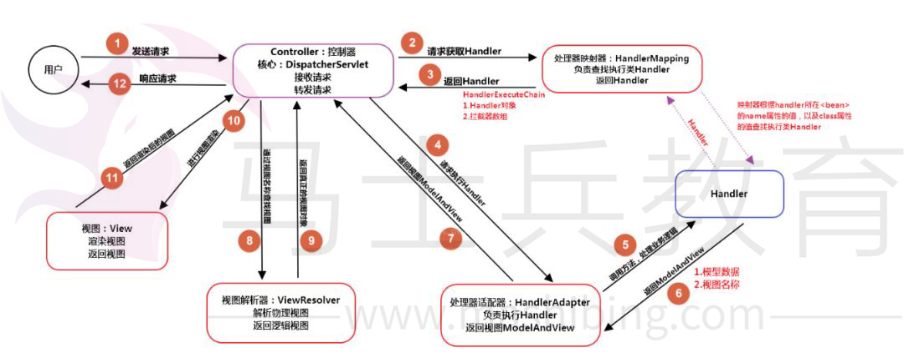

# Java Web 面试中关于Spring MVC的必问题,不收藏血亏！


Spring MVC是Spring构建在Servlet API上的Web框架。目前大部分的Java Web 开发已经使用Spring MVC 来做。它提供了模型 - 视图 - 控制器架构，可用于开发灵活的Web应用程序。在本教程中，我们将重点关注与之相关的问题，因为它通常是Spring开发人员面试的热点问题。强烈建议收藏！


## Q


**为什么选择Spring MVC ？**

## A


Spring MVC 实现了一些明确而且相对低耦合的概念，可以让开发者很容易开发和测试他们的Web应用。这些概念有：

- Dispatcher Servlet ——核心Servlet前置控制器，配置在web.xml文件中的。

  拦截匹配的请求，Servlet拦截匹配规则要自己定义，把拦截下来的请求，依据相应的规则分发到目标Controller来处理

- Controllers ——具体的业务控制器，处理具体请求的业务并响应

- View Resolvers ——视图解析器，用于将响应的逻辑视图解析为真正的视图View对象

- Views, Models ——Views的主要作用是用于处理响应视图，然后返回给客户端，Models主要用于传递控制方法处理数据到响应视图页面

- ModelAndView ——Model 和 View 的复合体

- Model and Session Attributes ——对模型属性和会话属性的处理


这些概念都是完全独立而且职责单一。因此Spring MVC给了我们很大的灵活性。它基于接口（提供的实现类），我们可以使用自定义接口配置框架的每个部分。另一个重要的事情是我们不再依赖于特定的视图技术（例如，JSP），可以选择我们最复合业务的视图技术。此外，我们不仅仅在Web应用程序开发中使用Spring MVC，也可以用它创建RESTful Web服务。 

## Q


**SpringMVC的流程是什么？**

## A


1. 用户发送请求至前端控制器DispatcherServlet；

2. DispatcherServlet收到请求后，调用HandlerMapping处理器映射器，请求获取Handle；

3. 处理器映射器根据请求url找到具体的处理器，生成处理器对象及处理器拦截器(如果有)一并返回给DispatcherServlet；

4. DispatcherServlet 调用 HandlerAdapter处理器适配器；

5. HandlerAdapter 经过适配调用 具体处理器(Handler，也叫后端控制器)；

6. Handler执行完成返回ModelAndView；

7. HandlerAdapter将Handler执行结果ModelAndView返回给DispatcherServlet；

8. DispatcherServlet将ModelAndView传给ViewResolver视图解析器进行解析；

9. ViewResolver解析后返回具体View；

10. DispatcherServlet对View进行渲染视图（即将模型数据填充至视图中）

11. DispatcherServlet响应用户。

流程图：




## Q


**@Autowired 注解的规则是什么？**

## A


@Autowired注解可以使用在成员属性上或方法上，按类型注入Spring bean。这个注解允许Spring解析协作的bean并注入到你业务需要的bean中。 

## Q


**简述一下注解@ModelAttribute 。**

## A


@ModelAttribute注解是Spring MVC中最重要的注解之一。它将方法参数或方法返回值绑定到命名中的Model属性中，然后将其公开给Web视图。如果我们在方法级别使用它，则表明该方法的目的是添加一个或多个模型属性。另一方面，当用作方法参数时，它表示应从模型中检索参数。如果不存在，我们应该首先实例化它，然后将其添加到Model中。一旦出现在模型中，我们应该填充所有具有匹配名称的请求参数的参数字段。 

## Q


**@Controller和@RestController之间有什么区别？**

## A


@Controller和@RestController注释之间的主要区别在于@ResponseBody注解功能已经自动包含在@RestController中。这意味着我们不需要使用@ResponseBody来注释我们的处理程序方法。 

## **Q**


**描述一下 @PathVariable注解 。**

## A


我们可以使用@PathVariable注解来从请求URI中提取一个特定模版变量的值来作为我们的请求参数。例如 从/user/123提取值123给/user/{id}控制器来获取一个id=123的数据映射关系。需要特别指出的是通过此注解获取的值不会被编码。具体可通过我的文章来获取原因。 

## Q


**如何在Spring MVC中校验参数？** 

## A


Spring MVC 默认支持JSR-303校验规范 。并在Spring-Boot-starter-web中提供了JSR-303规范实现Hibernate Validator。我们可以使用它来进行参数校验。详情可查看我的相关文章。 


## Q


**@RequestBody 和 @ResponseBody是干嘛用的？**

A


1. @RequestBody注解用于控制器方法参数上，目的是将Http 请求体转换为领域对象（请求参数）。Spring 通过`HttpMessageConverter`将请求体反序列化到Java对象中，默认使用jackson类库反序列化。


2. @ResponseBody注解使用于Spring MVC控制器中的处理程序方法上，它表明我们将把方法的返回类型直接写入HTTP响应主体而不会将它放在Model中，同样不会将其解释为视图名称。 


## Q


**Spring MVC 拦截器有什么用怎么用？**

## A


Spring MVC拦截器允许我们拦截客户端请求并在三个地方处理它 - 在处理之前，处理之后或完成之后（在呈现视图时）。拦截器切面处理一些公共逻辑而避免重复处理程序代码（如日志记录），也可以用来更改Spring模型中全局使用的参数。通过以下方式:

- org.springframework.web.servlet.handler.HandlerInterceptorAdapter —继承该类
- org.springframework.web.servlet.HandlerInterceptor—实现该接口 


## Q


**如何全局处理控制器异常？** 

## A


通过@ControllerAdvice 或者@RestControllerAdvice 和@ExceptionHandler注解组合，通过在方法入参中捕获异常进行处理，举例如下：

 

```
@Slf4j
@RestControllerAdvice("cn.felord.manage.api")
public class GlobalExceptionControllerAdvice {

    @ExceptionHandler(NullPointerException.class)
    public Rest nullPointHandler(HttpServletRequest request, NullPointerException e) {
        log.error("空指针啦，赶紧关注公众号：Felordcn", e);
        return RestBody.failure(-1, "null point exception");
    }
}
```

## Q


**如何处理Spring MVC 中的跨域问题？**

## A


Spring MVC 解决跨域问题主要有以下几种办法：

- 通过Spring MVC 拦截器来处理，同理servlet中的filter也可以处理。
- 通过在控制层方法使用@CrossOrigin注解。 请注意该方案需要在Spring MVC 4.x 以上。
- 通过在Spring MVC xml配置文件中的<mvc:cors>标签中配置。
- 通过`WebMvcConfigurer#addCorsMappings(CorsRegistry)`来配置。


如果想具体深入可通过公众号：**Felordcn** 来获取具体的教程。 

## Q


**如何格式化Spring MVC如参参数？**

## A


一般可通过两种方式：

- 实现org.springframework.core.convert.

  converter.Converter<S,T> ，并将实现注入Spring容器中。

- 实现org.springframework.format.

  Formatter<T> ，并将实现注入Spring 容器中。 