# Redis 集群搭建详细指南


## 先有鸡还是先有蛋？

最近有朋友问了一个问题，说毕业后去大城市还是小城市？去大公司还是小公司？我的回答都是大城市！大公司！
为什么这么说呢，你想一下，无论女孩男孩找朋友都喜欢找个子高胸大的。同样的道理嘛，「大」总有大的好。
当然，如果你要有能力找一个胸大个子高就更完美了。

## Redis 集群简介

Redis 是一个开源的 key-value 存储系统，由于出众的性能，大部分互联网企业都用来做服务器端缓存。Redis 在3.0版本前只支持单实例模式，虽然支持主从模式、哨兵模式部署来解决单点故障，但是现在互联网企业动辄大几百G的数据，可完全是没法满足业务的需求，所以，Redis 在 3.0 版本以后就推出了集群模式。

Redis 集群采用了P2P的模式，完全去中心化。Redis 把所有的 Key 分成了 16384 个 slot，每个 Redis 实例负责其中一部分 slot 。集群中的所有信息（节点、端口、slot等），都通过节点之间定期的数据交换而更新。
Redis 客户端可以在任意一个 Redis 实例发出请求，如果所需数据不在该实例中，通过重定向命令引导客户端访问所需的实例。

## 随随便便搭建一个集群

安装部署任何一个应用其实都很简单，只要安装步骤一步一步来就行了。下面说一下 Redis 集群搭建规划，由于集群至少需要6个节点（3主3从模式），所以，没有这么多机器给我玩，我本地也起不了那么多虚拟机（电脑太烂），现在计划是在一台机器上模拟一个集群，当然，这和生产环境的集群搭建没本质区别。

我现在就要在已经有安装了 Redis 的一个 CentOS 下开始进行集群搭建，如果你还不是很清楚 Linux 下如何安装 Redis ，可以去看这一篇文章《了解一下 Redis 并在 CentOS 下进行安装配置》。请注意，下面所有集群搭建环境都基于已安装好的 Redis 做的。

**1.创建文件夹**
我们计划集群中 Redis 节点的端口号为 `9001-9006` ，端口号即集群下各实例文件夹。数据存放在 `端口号/data` 文件夹中。

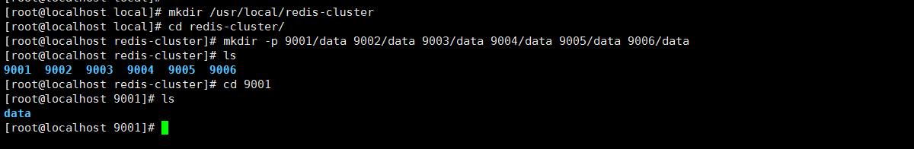

```
mkdir /usr/local/redis-cluster
cd redis-cluster/
mkdir -p 9001/data 9002/data 9003/data 9004/data 9005/data 9006/data
```

**2.复制执行脚本**
在 `/usr/local/redis-cluster` 下创建 `bin` 文件夹，用来存放集群运行脚本，并把安装好的 Redis 的 `src` 路径下的运行脚本拷贝过来。看命令：

```
mkdir redis-cluster/bin
cd /usr/local/redis/src
cp mkreleasehdr.sh redis-benchmark redis-check-aof redis-check-dump redis-cli redis-server redis-trib.rb /usr/local/redis-cluster/bin
```

**3.复制一个新 Redis 实例**
我们现在从已安装好的 Redis 中复制一个新的实例到 `9001` 文件夹，并修改 `redis.conf` 配置。

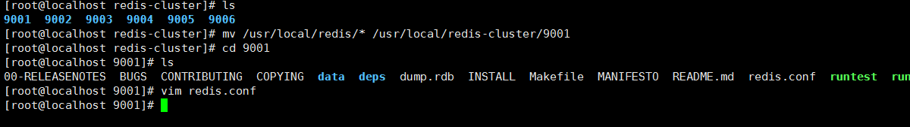

```
cp /usr/local/redis/* /usr/local/redis-cluster/9001
```

注意，修改 `redis.conf` 配置和单点唯一区别是下图部分，其余还是常规的这几项：

```
port 9001（每个节点的端口号）
daemonize yes
bind 192.168.119.131（绑定当前机器 IP）
dir /usr/local/redis-cluster/9001/data/（数据文件存放位置）
pidfile /var/run/redis_9001.pid（pid 9001和port要对应）
cluster-enabled yes（启动集群模式）
cluster-config-file nodes9001.conf（9001和port要对应）
cluster-node-timeout 15000
appendonly yes
```

集群搭建配置重点就是取消下图中的这三个配置的注释：

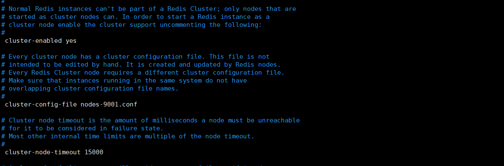

**4.再复制出五个新 Redis 实例**
我们已经完成了一个节点了，其实接下来就是机械化的再完成另外五个节点，其实可以这么做：把 `9001 实例` 复制到另外五个文件夹中，唯一要修改的就是 `redis.conf` 中的所有和端口的相关的信息即可，其实就那么四个位置。开始操作，看图：

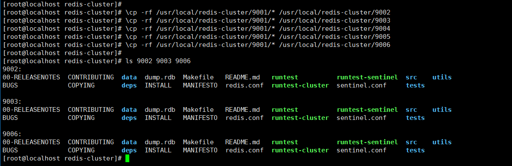

```
\cp -rf /usr/local/redis-cluster/9001/* /usr/local/redis-cluster/9002
\cp -rf /usr/local/redis-cluster/9001/* /usr/local/redis-cluster/9003
\cp -rf /usr/local/redis-cluster/9001/* /usr/local/redis-cluster/9004
\cp -rf /usr/local/redis-cluster/9001/* /usr/local/redis-cluster/9005
\cp -rf /usr/local/redis-cluster/9001/* /usr/local/redis-cluster/9006
```

`\cp -rf` 命令是不使用别名来复制，因为 `cp` 其实是别名 `cp -i`，操作时会有交互式确认，比较烦人。

**5.修改 9002-9006 的 redis.conf 文件**
其实非常简单了，你通过搜索会发现其实只有四个点需要修改，我们全局替换下吧，进入相应的节点文件夹，做替换就好了。命令非常简单，看图：

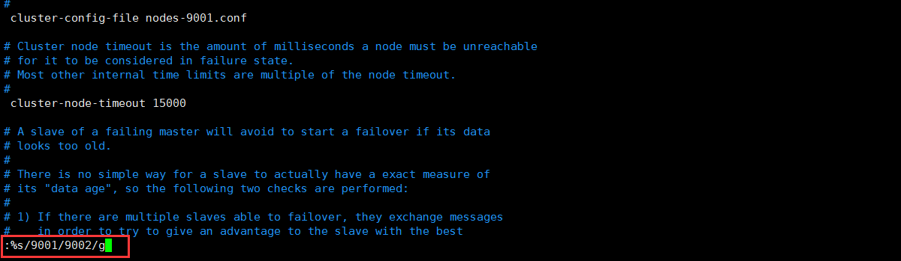

```
vim redis.conf
:%s/9001/9002g
```

回车后，就会有替换几个地方成功的提示，不放心可以手工检查下：

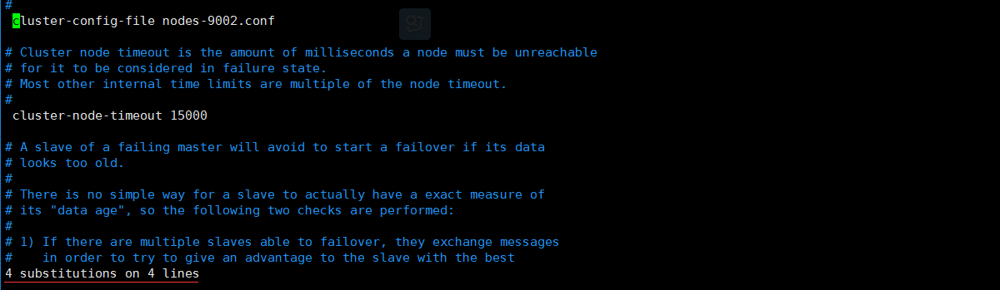

其实我们也就是替换了下面这四行：

```
port 9002
dir /usr/local/redis-cluster/9002/data/
cluster-config-file nodes-9002.conf
pidfile /var/run/redis_9002.pid
```

到这里，我们已经把最基本的环境搞定了，接下来就是启动了。

## 其实我们已经几乎搭建好了

**1.启动 9001-9006 六个节点**
少废话，直接看图：

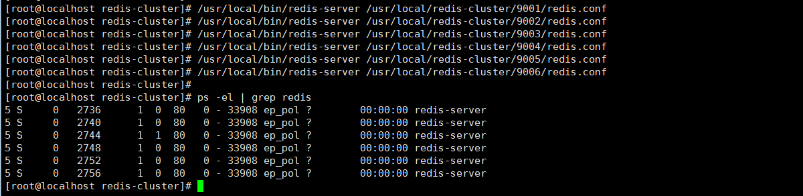

```
/usr/local/bin/redis-server /usr/local/redis-cluster/9001/redis.conf 
/usr/local/bin/redis-server /usr/local/redis-cluster/9002/redis.conf 
/usr/local/bin/redis-server /usr/local/redis-cluster/9003/redis.conf 
/usr/local/bin/redis-server /usr/local/redis-cluster/9004/redis.conf 
/usr/local/bin/redis-server /usr/local/redis-cluster/9005/redis.conf 
/usr/local/bin/redis-server /usr/local/redis-cluster/9006/redis.conf
```

可以检查一下是否启动成功：`ps -el | grep redis`
看的出来，六个节点已经全部启动成功了。

**2.随便找一个节点测试试**

```
/usr/local/redis-cluster/bin/redis-cli -h 192.168.119.131 -p 9001

set name mafly
```

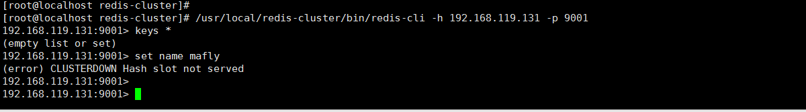

连接成功了，但好像报错了阿？？？
`(error) CLUSTERDOWN Hash slot not served（不提供集群的散列槽）`，这是什么鬼？
这是因为虽然我们配置并启动了 Redis 集群服务，但是他们暂时还并不在一个集群中，互相直接发现不了，而且还没有可存储的位置，就是所谓的**slot（槽）**。

**3.安装集群所需软件**
由于 Redis 集群需要使用 ruby 命令，所以我们需要安装 ruby 和相关接口。

```
yum install ruby
yum install rubygems
gem install redis 
```

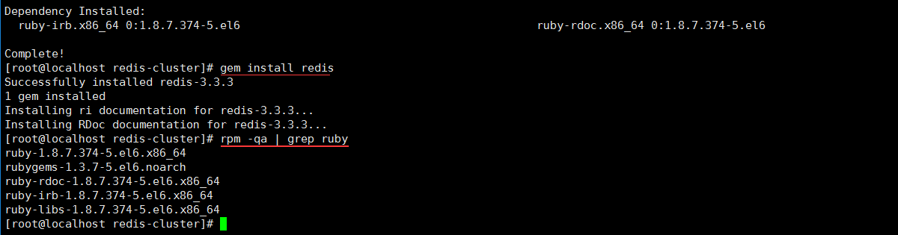

## 这才是真正的创建集群

先不废话，直接敲命令：

```
/usr/local/redis-cluster/bin/redis-trib.rb create --replicas 1 192.168.119.131:9
```

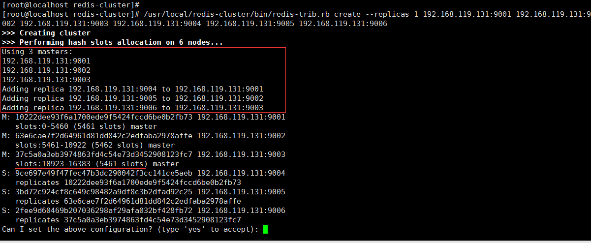

简单解释一下这个命令：调用 ruby 命令来进行创建集群，`--replicas 1` 表示主从复制比例为 1:1，即一个主节点对应一个从节点；然后，默认给我们分配好了每个主节点和对应从节点服务，以及 solt 的大小，因为在 Redis 集群中有且仅有 16383 个 solt ，默认情况会给我们平均分配，当然你可以指定，后续的增减节点也可以重新分配。

`M: 10222dee93f6a1700ede9f5424fccd6be0b2fb73` 为主节点Id

`S: 9ce697e49f47fec47b3dc290042f3cc141ce5aeb 192.168.119.131:9004 replicates 10222dee93f6a1700ede9f5424fccd6be0b2fb73` 从节点下对应主节点Id

目前来看，`9001-9003` 为主节点，`9004-9006` 为从节点，并向你确认是否同意这么配置。输入 `yes` 后，会开始集群创建。

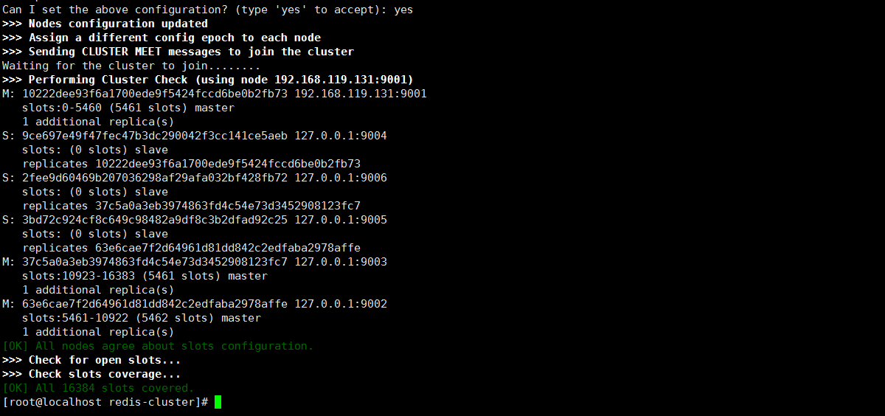

上图则代表集群搭建成功啦！！！

**验证一下：**
依然是通过客户端命令连接上，通过集群命令看一下状态和节点信息等。

```
/usr/local/redis-cluster/bin/redis-cli -c -h 192.168.119.131 -p 9001
cluster info
cluster nodes
```

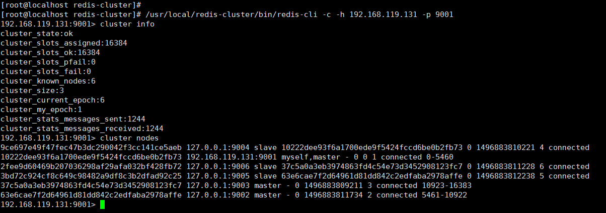

通过命令，可以详细的看出集群信息和各个节点状态，主从信息以及连接数、槽信息等。这么看到，我们已经真的把 Redis 集群搭建部署成功啦！

**设置一个 mafly：**
你会发现，当我们 `set name mafly` 时，出现了 `Redirected to slot` 信息并自动连接到了`9002`节点。这也是集群的一个数据分配特性，这里不详细说了。

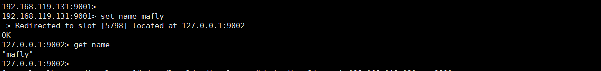

## 总结一下

这一篇 Redis 集群部署搭建的文章真的是一步一步的走下来的，只要你安装我的步骤来，就保证你能成功搭建一个 Redis 集群玩玩，也可以这么说，除了步骤繁琐外，几乎不存在技术含量，估计能看完的人都感觉累（说真的，写这种文章真的很累人）。

接下来可能就是动态扩容、增加节点和减少节点，重新分配槽大小等，当然，还有最重要的就是怎么和我们程序结合起来，以及如何更好的把 Redis 缓存集群发挥出应有的效果，这些才是最重要的。