# RocketMQ实战（一）

**阿里巴巴有2大核心的分布式技术，一个是OceanBase，另一个就是RocketMQ。在实际项目中已经领教过RocketMQ的强大，本人计划写一个RocketMQ实战系列，将涵盖RocketMQ的简介，环境搭建，初步使用、API详解、架构分析、管理员集群操作等知识。**

# What is RocketMQ?

RocketMQ作为一款分布式的消息中间件（阿里的说法是不遵循任何规范的，所以不能完全用JMS的那一套东西来看它），经历了Metaq1.x、Metaq2.x的发展和淘宝双十一的洗礼，在功能和性能上远超ActiveMQ。

> **1.要知道RocketMQ原生就是支持分布式的，而ActiveMQ原生存在单点性。**
>
> **2.RocketMQ可以保证严格的消息顺序，而ActiveMQ无法保证！**
>
> **3.RocketMQ提供亿级消息的堆积能力，这不是重点，重点是堆积了亿级的消息后，依然保持写入低延迟！**
>
> **4.丰富的消息拉取模式（Push or Pull）**
>
> **Push好理解，比如在消费者端设置Listener回调；而Pull，控制权在于应用，即应用需要主动的调用拉消息方法从Broker获取消息，这里面存在一个消费位置记录的问题（如果不记录，会导致消息重复消费）。**
>
> **5.在Metaq1.x/2.x的版本中，分布式协调采用的是Zookeeper，而RocketMQ自己实现了一个NameServer，更加轻量级，性能更好！**
>
> **6.消息失败重试机制、高效的订阅者水平扩展能力、强大的API、事务机制等等（后续详细介绍）**

#  

# 初步理解Producer/Consumer Group 

ActiveMQ中并没有Group这个概念，而在RocketMQ中理解Group的机制很重要。

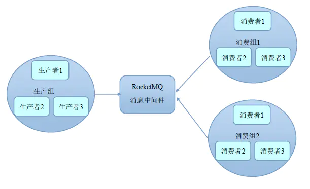

> **想过没有，通过Group机制，让RocketMQ天然的支持消息负载均衡！**
>
> **比如某个Topic有9条消息，其中一个Consumer Group有3个实例（3个进程 OR 3台机器），那么每个实例将均摊3条消息！（注意RocketMQ只有一种模式，即发布订阅模式。）**

#  

# install RocketMQ

> **RocketMQ的Broker集群部署模式还挺多的，比如单Master模式、多Master模式、多Master多Slave模式（异步复制）、多Master多Slave模式（同步双写）等。明确个概念，RocketMQ Slave不可以写，可以读，类似于MySQL的主从机制。**
>
> **单Master模式：
> **
>
> **无需多言，一旦单个broker重启或宕机，一切都结束了！很显然，线上不可以使用。**
>
> **多Master模式：**
>
> **全是Master，没有Slave。当然，一个broker宕机了，应用是无影响的，缺点在于宕机的Master上未被消费的消息在Master没有恢复之前不可以订阅。**
>
> **多Master多Slave模式（异步复制）：**
>
> **多对Master-Slave，高可用！采用异步复制的方式，主备之间短暂延迟，MS级别。Master宕机，消费者可以从Slave上进行消费，不受影响，但是Master的宕机，会导致丢失掉极少量的消息。**
>
> **多Master多Slave模式（同步双写）：**
>
> **和上面的区别点在于采用的是同步方式，也就是在Master/Slave都写成功的前提下，向应用返回成功，可见不论是数据，还是服务都没有单点，都非常可靠！缺点在于同步的性能比异步稍低。**

这里我将采用2个Master的方式进行搭建演示，会了双Master，其他的将很简单。（多Master在实际中也是非常常用的，如果并发非常大，考虑多Master多Slave模式）

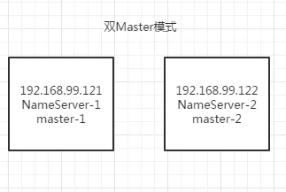

> 在192.168.99.121/122机器上各一个NameServer、Master进程。

以192.168.99.121为例：

**第一步，修改/etc/hosts文件**

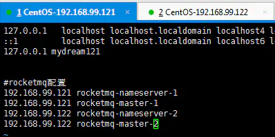

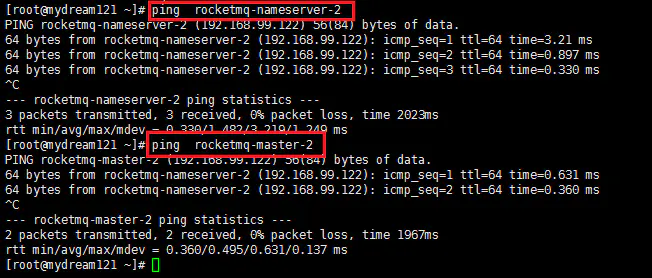

**第二步，解压并创建存储路径**

> **tar -xvf alibaba-rocketmq-3.2.6.tar.gz
> **
>
> **mkdir -p alibaba-rocketmq/store/{commitlog,consumequeue,index}**

**第三步，配置文件**

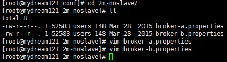

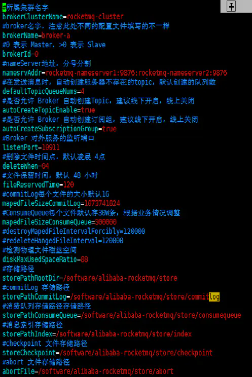

> 上面已经将实际中常用的配置项给出来了！

**第四步，修改日志配置文件**

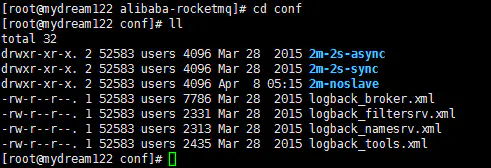

注意到logback.*.xml配置文件中：

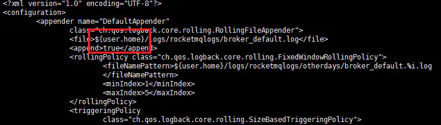

可以使用sed进行替换：

> **sed -i 's#${user.home}#/software/alibaba-rocketmq#g' \*.xml
> **

**第五步，修改启动脚本中的JVM参数**

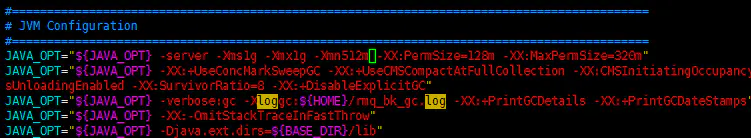

> **注意，在这里我将JVM的堆的初始化和最大大小统一设置为1G，并将新生代大小设置为512M。主要是考虑到我的虚拟机内存，实际上在线上是可以走默认的4G堆内存的。**

**第六步，启动NameServer**

> **nohup sh mqnamesrv &**

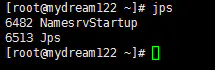

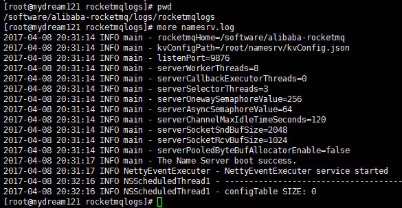

**第七步，启动broker-X**

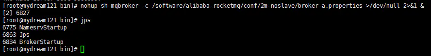

注意观察日志：

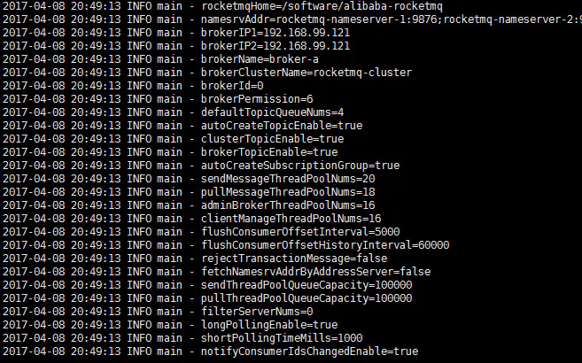

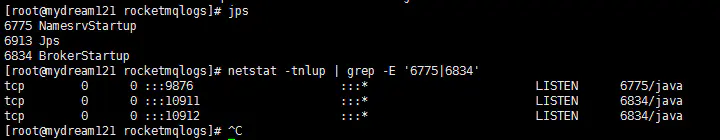

**第八步：RocketMQ Console**

> 把rocketmq-console.war部署到Tomcat下即可。

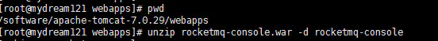

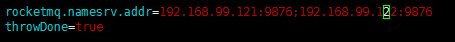

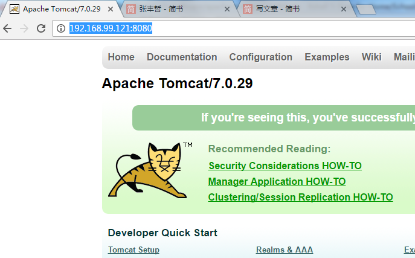

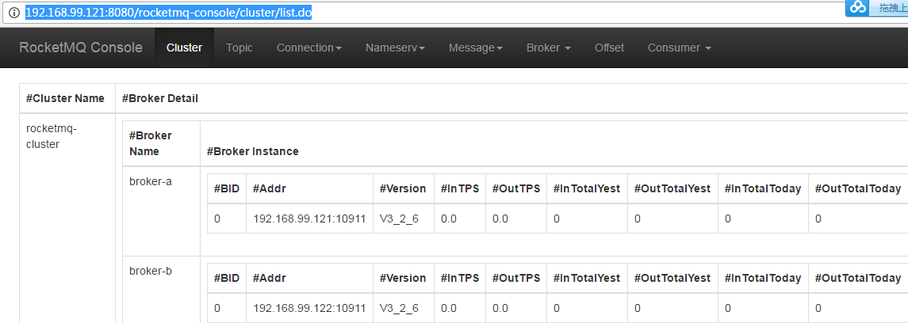

> **这个管控台实际上还是比较简陋的，我们使用比较多的是mqadmin操作命令，后续会介绍。**

**OK，到这里，双Master的搭建已经完成了！**