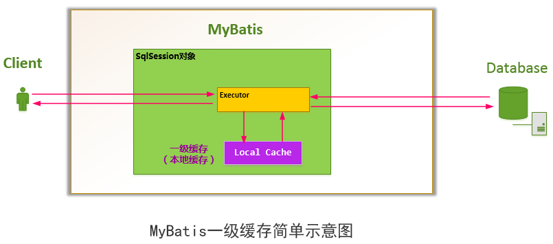

# mybatis一级缓存二级缓存


## 一级缓存

　　Mybatis对缓存提供支持，但是在没有配置的默认情况下，它只开启一级缓存，一级缓存只是相对于同一个SqlSession而言。所以在参数和SQL完全一样的情况下，我们使用同一个SqlSession对象调用一个Mapper方法，往往只执行一次SQL，因为使用SelSession第一次查询后，MyBatis会将其放在缓存中，以后再查询的时候，如果没有声明需要刷新，并且缓存没有超时的情况下，SqlSession都会取出当前缓存的数据，而不会再次发送SQL到数据库。



　为什么要使用一级缓存，不用多说也知道个大概。但是还有几个问题我们要注意一下。

　　**1、一级缓存的生命周期有多长？**

　　a、MyBatis在开启一个数据库会话时，会 创建一个新的SqlSession对象，SqlSession对象中会有一个新的Executor对象。Executor对象中持有一个新的PerpetualCache对象；当会话结束时，SqlSession对象及其内部的Executor对象还有PerpetualCache对象也一并释放掉。

　　b、如果SqlSession调用了close()方法，会释放掉一级缓存PerpetualCache对象，一级缓存将不可用。

　　c、如果SqlSession调用了clearCache()，会清空PerpetualCache对象中的数据，但是该对象仍可使用。

　　d、SqlSession中执行了任何一个update操作(update()、delete()、insert()) ，都会清空PerpetualCache对象的数据，但是该对象可以继续使用

　  **2、怎么判断某两次查询是完全相同的查询？**

　　mybatis认为，对于两次查询，如果以下条件都完全一样，那么就认为它们是完全相同的两次查询。

　　2.1 传入的statementId

　　2.2 查询时要求的结果集中的结果范围

　　2.3. 这次查询所产生的最终要传递给JDBC java.sql.Preparedstatement的Sql语句字符串（boundSql.getSql() ）

　　2.4 传递给java.sql.Statement要设置的参数值

## 二级缓存：

　　MyBatis的二级缓存是Application级别的缓存，它可以提高对数据库查询的效率，以提高应用的性能。

### 　　MyBatis的缓存机制整体设计以及二级缓存的工作模式


　　SqlSessionFactory层面上的二级缓存默认是不开启的，二级缓存的开席需要进行配置，实现二级缓存的时候，MyBatis要求返回的POJO必须是可序列化的。 也就是要求实现Serializable接口，配置方法很简单，只需要在映射XML文件配置就可以开启缓存了<cache/>，如果我们配置了二级缓存就意味着：

- 映射语句文件中的所有select语句将会被缓存。
- 映射语句文件中的所欲insert、update和delete语句会刷新缓存。
- 缓存会使用默认的Least Recently Used（LRU，最近最少使用的）算法来收回。
- 根据时间表，比如No Flush Interval,（CNFI没有刷新间隔），缓存不会以任何时间顺序来刷新。
- 缓存会存储列表集合或对象(无论查询方法返回什么)的1024个引用
- 缓存会被视为是read/write(可读/可写)的缓存，意味着对象检索不是共享的，而且可以安全的被调用者修改，不干扰其他调用者或线程所做的潜在修改。

### 实践：

### 一、创建一个POJO Bean并序列化

　　由于二级缓存的数据不一定都是存储到内存中，它的存储介质多种多样，所以需要给缓存的对象执行序列化。(如果存储在内存中的话，实测不序列化也可以的。)


```
package com.yihaomen.mybatis.model;

import com.yihaomen.mybatis.enums.Gender;
import java.io.Serializable;
import java.util.List;

/**
 *  @ProjectName: springmvc-mybatis 
 */
public class Student implements Serializable{

    private static final long serialVersionUID = 735655488285535299L;
    private String id;
    private String name;
    private int age;
    private Gender gender;
    private List<Teacher> teachers;
    setters&getters()....;
    toString();        
}
```


 

###  二、在映射文件中开启二级缓存


```
<?xml version="1.0" encoding="UTF-8" ?>
<!DOCTYPE mapper PUBLIC "-//mybatis.org//DTD Mapper 3.0//EN"
        "http://mybatis.org/dtd/mybatis-3-mapper.dtd">
<mapper namespace="com.yihaomen.mybatis.dao.StudentMapper">
    <!--开启本mapper的namespace下的二级缓存-->
    <!--
        eviction:代表的是缓存回收策略，目前MyBatis提供以下策略。
        (1) LRU,最近最少使用的，一处最长时间不用的对象
        (2) FIFO,先进先出，按对象进入缓存的顺序来移除他们
        (3) SOFT,软引用，移除基于垃圾回收器状态和软引用规则的对象
        (4) WEAK,弱引用，更积极的移除基于垃圾收集器状态和弱引用规则的对象。这里采用的是LRU，
                移除最长时间不用的对形象

        flushInterval:刷新间隔时间，单位为毫秒，这里配置的是100秒刷新，如果你不配置它，那么当
        SQL被执行的时候才会去刷新缓存。

        size:引用数目，一个正整数，代表缓存最多可以存储多少个对象，不宜设置过大。设置过大会导致内存溢出。
        这里配置的是1024个对象

        readOnly:只读，意味着缓存数据只能读取而不能修改，这样设置的好处是我们可以快速读取缓存，缺点是我们没有
        办法修改缓存，他的默认值是false，不允许我们修改
    -->
    <cache eviction="LRU" flushInterval="100000" readOnly="true" size="1024"/>
    <resultMap id="studentMap" type="Student">
        <id property="id" column="id" />
        <result property="name" column="name" />
        <result property="age" column="age" />
        <result property="gender" column="gender" typeHandler="org.apache.ibatis.type.EnumOrdinalTypeHandler" />
    </resultMap>
    <resultMap id="collectionMap" type="Student" extends="studentMap">
        <collection property="teachers" ofType="Teacher">
            <id property="id" column="teach_id" />
            <result property="name" column="tname"/>
            <result property="gender" column="tgender" typeHandler="org.apache.ibatis.type.EnumOrdinalTypeHandler"/>
            <result property="subject" column="tsubject" typeHandler="org.apache.ibatis.type.EnumTypeHandler"/>
            <result property="degree" column="tdegree" javaType="string" jdbcType="VARCHAR"/>
        </collection>
    </resultMap>
    <select id="selectStudents" resultMap="collectionMap">
        SELECT
            s.id, s.name, s.gender, t.id teach_id, t.name tname, t.gender tgender, t.subject tsubject, t.degree tdegree
        FROM
            student s
        LEFT JOIN
            stu_teach_rel str
        ON
            s.id = str.stu_id
        LEFT JOIN
            teacher t
        ON
            t.id = str.teach_id
    </select>
    <!--可以通过设置useCache来规定这个sql是否开启缓存，ture是开启，false是关闭-->
    <select id="selectAllStudents" resultMap="studentMap" useCache="true">
        SELECT id, name, age FROM student
    </select>
    <!--刷新二级缓存
    <select id="selectAllStudents" resultMap="studentMap" flushCache="true">
        SELECT id, name, age FROM student
    </select>
    -->
</mapper>
```


 

### 三、在 mybatis-config.xml中开启二级缓存


```
<?xml version="1.0" encoding="UTF-8" ?>
<!DOCTYPE configuration PUBLIC "-//mybatis.org//DTD Config 3.0//EN"
        "http://mybatis.org/dtd/mybatis-3-config.dtd">
<configuration>
    <settings>
        <!--这个配置使全局的映射器(二级缓存)启用或禁用缓存-->
        <setting name="cacheEnabled" value="true" />
        .....
    </settings>
    ....
</configuration>
```


 

### 四、测试


```
package com.yihaomen.service.student;

import com.yihaomen.mybatis.dao.StudentMapper;
import com.yihaomen.mybatis.model.Student;
import com.yihaomen.mybatis.model.Teacher;
import com.yihaomen.service.BaseTest;
import org.apache.ibatis.session.SqlSession;
import org.apache.ibatis.session.SqlSessionFactory;
import java.util.List;

/**
 *   
 *  @ProjectName: springmvc-mybatis 
 */
public class TestStudent extends BaseTest {

    public static void selectAllStudent() {
        SqlSessionFactory sqlSessionFactory = getSession();
        SqlSession session = sqlSessionFactory.openSession();
        StudentMapper mapper = session.getMapper(StudentMapper.class);
        List<Student> list = mapper.selectAllStudents();
        System.out.println(list);
        System.out.println("第二次执行");
        List<Student> list2 = mapper.selectAllStudents();
        System.out.println(list2);
        session.commit();
        System.out.println("二级缓存观测点");
        SqlSession session2 = sqlSessionFactory.openSession();
        StudentMapper mapper2 = session2.getMapper(StudentMapper.class);
        List<Student> list3 = mapper2.selectAllStudents();
        System.out.println(list3);
        System.out.println("第二次执行");
        List<Student> list4 = mapper2.selectAllStudents();
        System.out.println(list4);
        session2.commit();

    }

    public static void main(String[] args) {
        selectAllStudent();
    }
}
```


 

**结果：**

[QC] DEBUG [main] org.apache.ibatis.transaction.jdbc.JdbcTransaction.setDesiredAutoCommit(98) | Setting autocommit to false on JDBC Connection [com.mysql.jdbc.JDBC4Connection@51e0173d]
**[QC] DEBUG [main] org.apache.ibatis.logging.jdbc.BaseJdbcLogger.debug(139) | ==> Preparing: SELECT id, name, age FROM student**
**[QC] DEBUG [main] org.apache.ibatis.logging.jdbc.BaseJdbcLogger.debug(139) | ==> Parameters:**
**[QC] DEBUG [main] org.apache.ibatis.logging.jdbc.BaseJdbcLogger.debug(139) | <== Total: 6**
[Student{id='1', name='刘德华', age=55, gender=null, teachers=null}, Student{id='2', name='张惠妹', age=49, gender=null, teachers=null}, Student{id='3', name='谢霆锋', age=35, gender=null, teachers=null}, Student{id='4', name='王菲', age=47, gender=null, teachers=null}, Student{id='5', name='汪峰', age=48, gender=null, teachers=null}, Student{id='6', name='章子怡', age=36, gender=null, teachers=null}]
第二次执行
[QC] DEBUG [main] org.apache.ibatis.cache.decorators.LoggingCache.getObject(62) | Cache Hit Ratio [com.yihaomen.mybatis.dao.StudentMapper]: 0.0
[Student{id='1', name='刘德华', age=55, gender=null, teachers=null}, Student{id='2', name='张惠妹', age=49, gender=null, teachers=null}, Student{id='3', name='谢霆锋', age=35, gender=null, teachers=null}, Student{id='4', name='王菲', age=47, gender=null, teachers=null}, Student{id='5', name='汪峰', age=48, gender=null, teachers=null}, Student{id='6', name='章子怡', age=36, gender=null, teachers=null}]
二级缓存观测点
[QC] DEBUG [main] org.apache.ibatis.cache.decorators.LoggingCache.getObject(62) | Cache Hit Ratio [com.yihaomen.mybatis.dao.StudentMapper]: 0.3333333333333333
[Student{id='1', name='刘德华', age=55, gender=null, teachers=null}, Student{id='2', name='张惠妹', age=49, gender=null, teachers=null}, Student{id='3', name='谢霆锋', age=35, gender=null, teachers=null}, Student{id='4', name='王菲', age=47, gender=null, teachers=null}, Student{id='5', name='汪峰', age=48, gender=null, teachers=null}, Student{id='6', name='章子怡', age=36, gender=null, teachers=null}]
第二次执行
[QC] DEBUG [main] org.apache.ibatis.cache.decorators.LoggingCache.getObject(62) | Cache Hit Ratio [com.yihaomen.mybatis.dao.StudentMapper]: 0.5
[Student{id='1', name='刘德华', age=55, gender=null, teachers=null}, Student{id='2', name='张惠妹', age=49, gender=null, teachers=null}, Student{id='3', name='谢霆锋', age=35, gender=null, teachers=null}, Student{id='4', name='王菲', age=47, gender=null, teachers=null}, Student{id='5', name='汪峰', age=48, gender=null, teachers=null}, Student{id='6', name='章子怡', age=36, gender=null, teachers=null}]

Process finished with exit code 0

 

我们可以从结果看到，sql只执行了一次，证明我们的二级缓存生效了。