# nginx负载均衡的5种策略及原理

nginx的upstream目前支持的5种方式的分配

**1、轮询（默认）**
每个请求按时间顺序逐一分配到不同的后端服务器，如果后端服务器down掉，能自动剔除。 
upstream backserver { 
server 192.168.0.14; 
server 192.168.0.15; 
} 

**2、指定权重**
指定轮询几率，weight和访问比率成正比，用于后端服务器性能不均的情况。 
upstream backserver { 
server 192.168.0.14 weight=8; 
server 192.168.0.15 weight=10; 
} 

**3、IP绑定 ip_hash**
每个请求按访问ip的hash结果分配，这样每个访客固定访问一个后端服务器，可以解决session的问题。 
upstream backserver { 
ip_hash; 
server 192.168.0.14:88; 
server 192.168.0.15:80; 
} 

**4、fair（第三方）**
按后端服务器的响应时间来分配请求，响应时间短的优先分配。 
upstream backserver { 
server server1; 
server server2; 
fair; 
} 

**5、url_hash（第三方）**
按访问url的hash结果来分配请求，使每个url定向到同一个后端服务器，后端服务器为缓存时比较有效。 
upstream backserver { 
server squid1:3128; 
server squid2:3128; 
hash $request_uri; 
hash_method crc32; 
} 

在需要使用负载均衡的server中增加 

proxy_pass http://backserver/; 
upstream backserver{ 
ip_hash; 
server 127.0.0.1:9090 down; (down 表示当前的server暂时不参与负载) 
server 127.0.0.1:8080 weight=2; (weight 默认为1.weight越大，负载的权重就越大) 
server 127.0.0.1:6060; 
server 127.0.0.1:7070 backup; (其它所有的非backup机器down或者忙的时候，请求backup机器) 
} 

max_fails ：允许请求失败的次数默认为1.当超过最大次数时，返回proxy_next_upstream 模块定义的错误 
fail_timeout:max_fails次失败后，暂停的时间

 

## 深入解析：

## 1 前言

随着网站负载的不断增加，负载均衡（load balance）已不是陌生话题。负载均衡是将流量负载分摊到不同的服务单元，保证服务器的高可用，保证响应足够快，给用户良好的体验。

nginx第一个公开版发布于2004年。2011年发布了1.0版。它的特点是稳定性高、功能强大、资源消耗低。从服务器市场占有率来看，nginx已有与Apache分庭抗礼势头。其中，不得不提到的特性就是其负载均衡功能，这也成了很多公司选择它的主要原因。

我们将从源码的角度介绍nginx的内置负载均衡策略和扩展负载均衡策略，以实际的工业生产为案例，对比各负载均衡策略，为nginx使用者提供一些参考。
 

## 2. 源码剖析

nginx的负载均衡策略可以划分为两大类：内置策略和扩展策略。

内置策略包含加权轮询和ip hash，在默认情况下这两种策略会编译进nginx内核，只需在nginx配置中指明参数即可。扩展策略有很多，如fair、通用hash、consistent hash等，默认不编译进nginx内核。

由于在nginx版本升级中负载均衡的代码没有本质性的变化，因此下面将以nginx1.0.15稳定版为例，从源码角度分析各个策略。

**2.1. 加权轮询（weighted round robin）**

轮询的原理很简单，首先我们介绍一下轮询的基本流程。如下是处理一次请求的流程图：

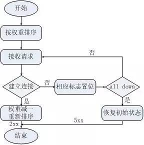

图中有两点需要注意：

第一，如果可以把加权轮询算法分为先深搜索和先广搜索，那么nginx采用的是先深搜索算法，即将首先将请求都分给高权重的机器，直到该机器的权值降到了比其他机器低，才开始将请求分给下一个高权重的机器。

第二，当所有后端机器都down掉时，nginx会立即将所有机器的标志位清成初始状态，以避免造成所有的机器都处在timeout的状态，从而导致整个前端被夯住。

接下来看下源码。nginx的目录结构很清晰，加权轮询所在路径为nginx-1.0.15/src/http/ngx_http_upstream_round_robin.[c|h]，在源码的基础上，针对重要的、不易理解的地方我加了注释。首先看下ngx_http_upstream_round_robin.h中的重要声明：

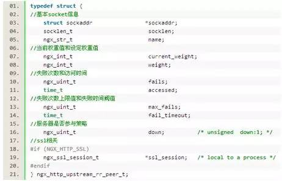

从变量命名中就可以大致猜出其作用。解释一下current_weight和weight的区别，前者为权重排序的值，随着处理请求会动态的变化，后者则是配置值，用来恢复初始状态。

接下我们来看下轮询的创建过程。代码如下图：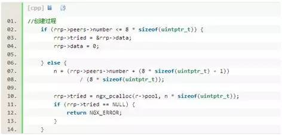

这里有个tried变量需要做些说明：tried中记录了服务器当前是否被尝试连接过。他是一个位图。如果服务器数量小于32，则只需在一个int中即可记录下所有服务器状态。如果服务器数量大于32，则需在内存池中申请内存来存储。

对该位图数组的使用可参考如下代码：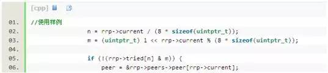

最后是实际的策略代码，逻辑较简单，代码实现也只有30行。来看代码。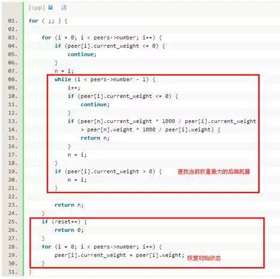

**2.2. ip hash策略**

ip hash是nginx内置的另一个负载均衡策略，流程和轮询很类似，只是其中的算法和具体的策略有些变化。如下图所示：

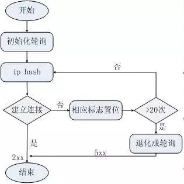

ip hash算法的核心实现请看如下代码：

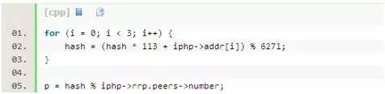

可以看到，hash值既与ip有关又与后端机器的数量有关。经测试，上述算法可以连续产生1045个互异的value，这是此算法硬限制。nginx使用了保护机制，当经过20次hash仍然找不到可用的机器时，算法退化成轮询。

因此，从本质上说，ip hash算法是一种变相的轮询算法，如果两个ip的初始hash值恰好相同，那么来自这两个ip的请求将永远落在同一台服务器上，这为均衡性埋下了较深隐患。

**2.3. fair**

fair策略是扩展策略，默认不被编译进nginx内核。它根据后端服务器的响应时间判断负载情况，从中选出负载最轻的机器进行分流。
这种策略具有很强的自适应性，但是实际的网络环境往往不是那么简单，因此须慎用。

**2.4.通用hash、一致性hash**

通用hash和一致性hash也是种扩展策略。通用hash可以以nginx内置的变量为key进行hash，一致性hash采用了nginx内置的一致性hash环，可支持memcache。
 

## 3 对比测试

了解了以上负载均衡策略，接下来我们来做一些测试。
主要是对比各个策略的均衡性、一致性、容灾性等，从而分析出其中的差异性，根据数据给出各自的适用场景。

为了能够全面、客观的测试nginx的负载均衡策略，我们采用两个测试工具、在不同场景下做测试，以此来降低环境对测试结果造成的影响。

首先给大家介绍测试工具、测试网络拓扑和基本之测试流程。

**3.1 测试工具**

*3.1.1 easyABC*

easyABC是百度内部开发的性能测试工具，培训采用epool模型实现，简单易上手，可以模拟GET/POST请求，极限情况下可以提供上万的压力，在团队内部得到广泛使用。

由于被测试对象为反向代理服务器，因此需要在其后端搭建桩服务器，这里用nginx作为桩Web Server，提供最基本的静态文件服务。

*3.1.2 polygraph*

polygraph是一款免费的性能测试工具，以对缓存服务、代理、交换机等方面的测试见长。它有规范的配置语言PGL（Polygraph Language），为软件提供了强大的灵活性。其工作原理如下图所示：

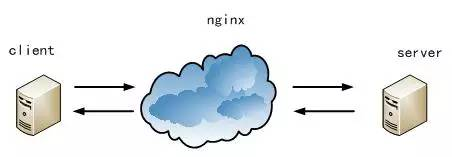

polygraph提供Client端和Server端，将测试目标nginx放在二者之间，三者之间的网络交互均走http协议，只需配置ip+port即可。

Client端可以配置虚拟robot的个数以及每个robot发请求的速率，并向代理服务器发起随机的静态文件请求，Server端将按照请求的url生成随机大小的静态文件做响应。

选用这个测试软件的一个主要原因：可以产生随机的url作为nginx各种hash策略key。
另外polygraph还提供了日志分析工具，功能比较丰富，感兴趣的同学可以参考附录材料。

**3.2. 测试环境**

本次测试运行在5台物理机。其中：被测对象单独搭在一台8核机器上，另外四台4核机器分别搭建了easyABC、webserver桩和polygraph。如下图所示：

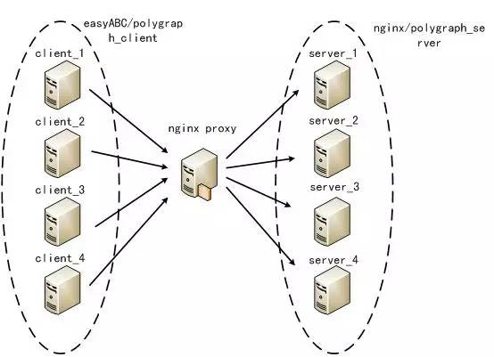

**3.3. 测试方案**

给各位介绍一下关键的测试指标：

均衡性：是否能够将请求均匀的发送给后端
一致性：同一个key的请求，是否能落到同一台机器
容灾性：当部分后端机器挂掉时，是否能够正常工作

以上述指标为指导，我们针对如下4个测试场景分别用easyABC和polygraph测试：

场景1   server_*均正常提供服务；
场景2   server_4挂掉，其他正常；
场景3   server_3、server_4挂掉，其他正常；
场景4   server_*均恢复正常服务。

上述四个场景将按照时间顺序进行，每个场景将建立在上一个场景基础上，被测试对象无需做任何操作，以最大程度模拟实际情况。

另外，考虑到测试工具自身的特点，在easyabc上的测试压力在17000左右，polygraph上的测试压力在4000左右。以上测试均保证被测试对象可以正常工作，且无任何notice级别以上（alert/error/warn）的日志出现，在每个场景中记录下server_*的qps用于最后的策略分析。

**3.4. 结果**

对比在两种测试工具下的测试结果会发现，结果完全一致，因此可以排除测试工具的影响。表1和图1是轮询策略在两种测试工具下的负载情况。

从图表中可以看出，轮询策略对于均衡性和容灾性都可以做到较好的满足。

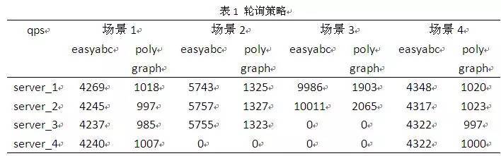

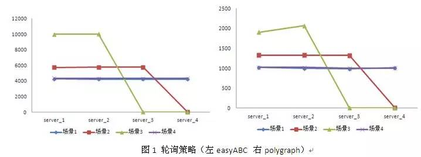

表2和图2是fair策略在两种测试工具下的负载情况。fair策略受环境影响非常大，在排除了测试工具的干扰之后，结果仍然有非常大的抖动。

从直观上讲，这完全不满足均衡性。但从另一个角度出发，恰恰是由于这种自适应性确保了在复杂的网络环境中能够物尽所用。因此，在应用到工业生产中之前，需要在具体的环境中做好测试工作。

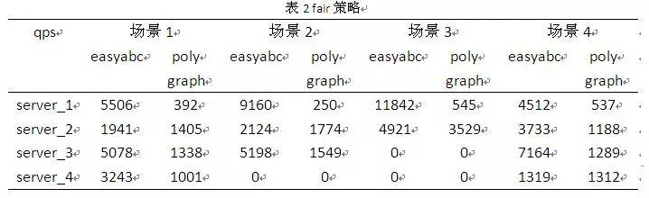

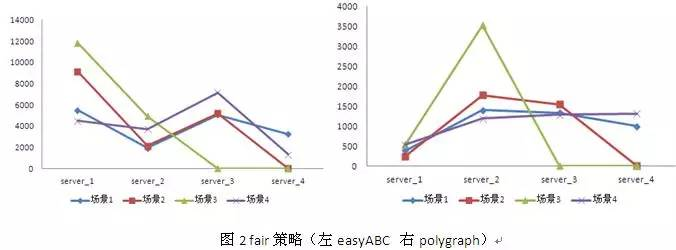

以下图表是各种hash策略，所不同的仅仅是hash key或者是具体的算法实现，因此一起做对比。实际测试中发现，通用hash和一致性hash均存在一个问题：当某台后端的机器挂掉时，原有落到这台机器上的流量会丢失，但是在ip hash中就不存在这样的问题。

正如上文中对ip hash源码的分析，当ip hash失效时，会退化为轮询策略，因此不会有丢失流量的情况。从这个层面上说，ip hash也可以看成是轮询的升级版。

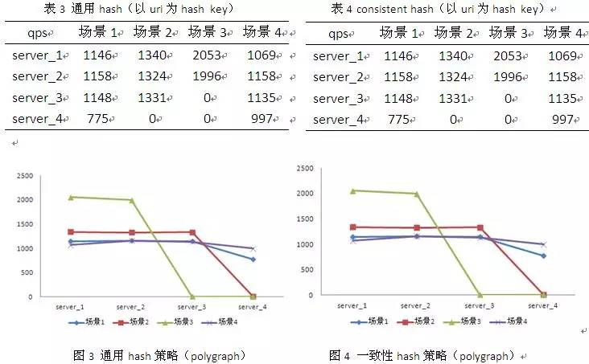

图5为ip hash策略，ip hash是nginx内置策略，可以看做是前两种策略的特例：以来源IP为key。

由于测试工具不太擅于模拟海量IP下的请求，因此这里截取线上实际的情况加以分析。如下图所示：

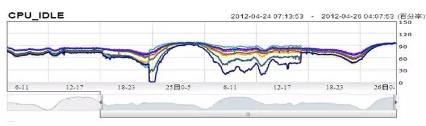

图中前1/3使用轮询策略，中间段使用ip hash策略，后1/3仍然是轮询策略。可以明显的看出，ip hash的均衡性存在着很大的问题。

原因并不难分析，在实际的网络环境中，有大量的高校出口路由器ip、企业出口路由器ip等网络节点，这些节点带来的流量往往是普通用户的成百上千倍，而ip hash策略恰恰是按照ip来划分流量，因此造成上述后果也就自然而然了。
 

## 4 小结

通过实际的对比测试，我们对nginx各个负载均衡策略进行了验证。下面从均衡性、一致性、容灾性以及适用场景等角度对比各种策略。如下图示：

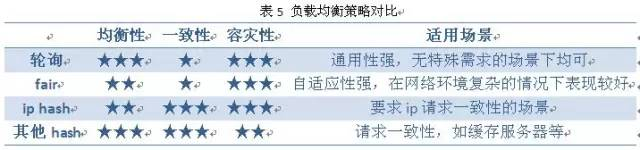

我们从源码和实际测试数据角度分析说明了nginx负载均衡的策略，给出了各种策略适合的应用场景。通过分析不难发现，无论哪种策略都不是万金油，在具体场景下应该选择哪种策略一定程度上依赖于使用者对策略的熟悉程度。

以上分析和测试数据能够对大家有所帮助，期待有更多越来越好的负载均衡策略涌现，造福更多运维开发同学。