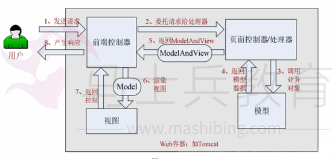
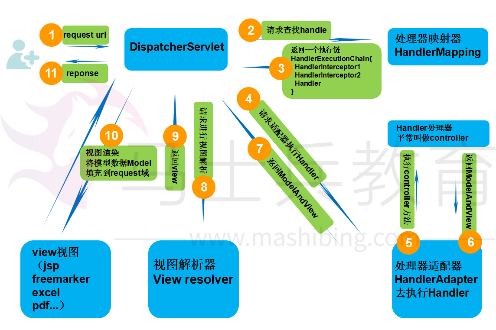

# springMVC请求流程详解

SpringMVC框架是一个基于请求驱动的Web框架，并且使用了‘前端控制器’模型来进行设计，再根据‘请求映射规则’分发给相应的页面控制器进行处理。

## **（一）整体流程**

具体步骤：

1、 首先用户发送请求到前端控制器，前端控制器根据请求信息（如 URL）来决定选择哪一个页面控制器进行处理并把请求委托给它，即以前的控制器的控制逻辑部分；图中的 1、2 步骤；

2、 页面控制器接收到请求后，进行功能处理，首先需要收集和绑定请求参数到一个对象，这个对象在 Spring Web MVC 中叫命令对象，并进行验证，然后将命令对象委托给业务对象进行处理；处理完毕后返回一个 ModelAndView（模型数据和逻辑视图名）；图中的 3、4、5 步骤；

3、 前端控制器收回控制权，然后根据返回的逻辑视图名，选择相应的视图进行渲染，并把模型数据传入以便视图渲染；图中的步骤 6、7；

4、 前端控制器再次收回控制权，将响应返回给用户，图中的步骤 8；至此整个结束。

 

## （二）核心流程

## **（三）总结 核心开发步骤**

1、 DispatcherServlet 在 web.xml 中的部署描述，从而拦截请求到 Spring Web MVC

2、 HandlerMapping 的配置，从而将请求映射到处理器

3、 HandlerAdapter 的配置，从而支持多种类型的处理器

注：处理器映射求和适配器使用纾解的话包含在了注解驱动中，不需要在单独配置

4、 ViewResolver 的配置，从而将逻辑视图名解析为具体视图技术

5、 处理器（页面控制器）的配置，从而进行功能处理 

View是一个接口，实现类支持不同的View类型（jsp、freemarker、pdf...）

 