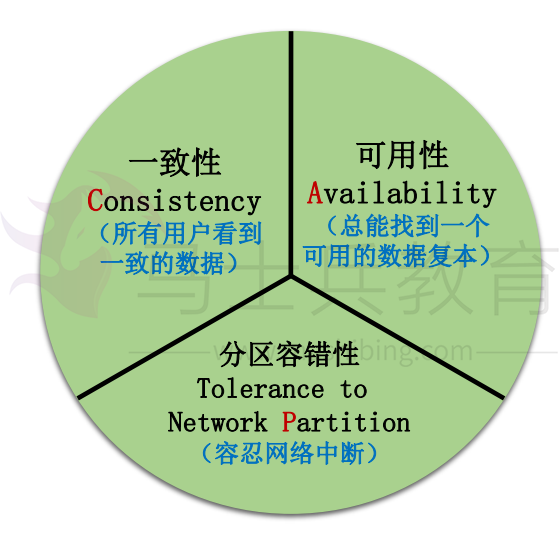
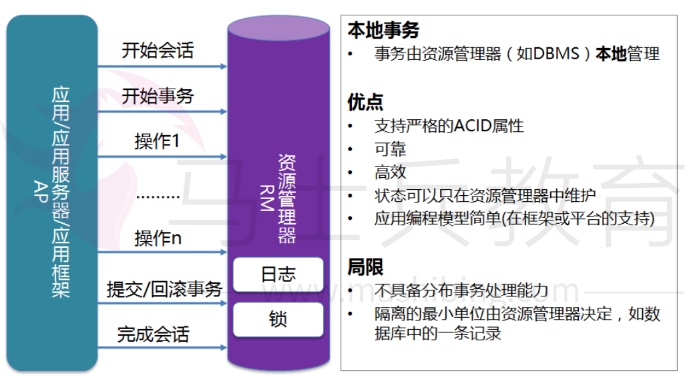
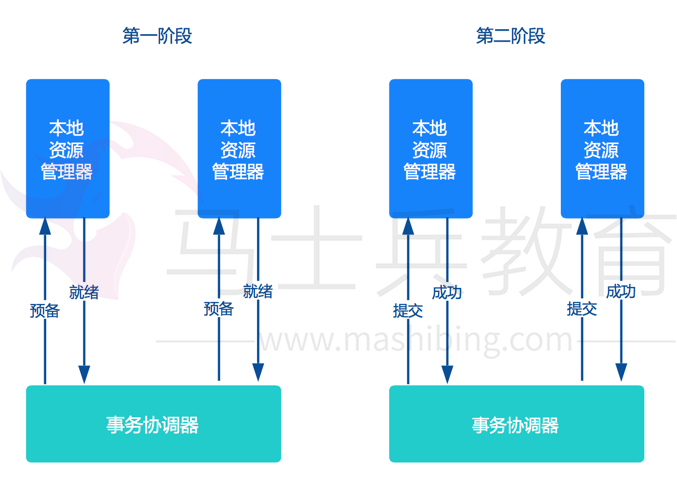
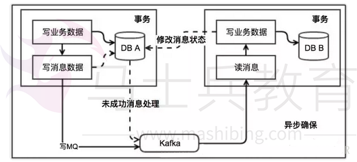
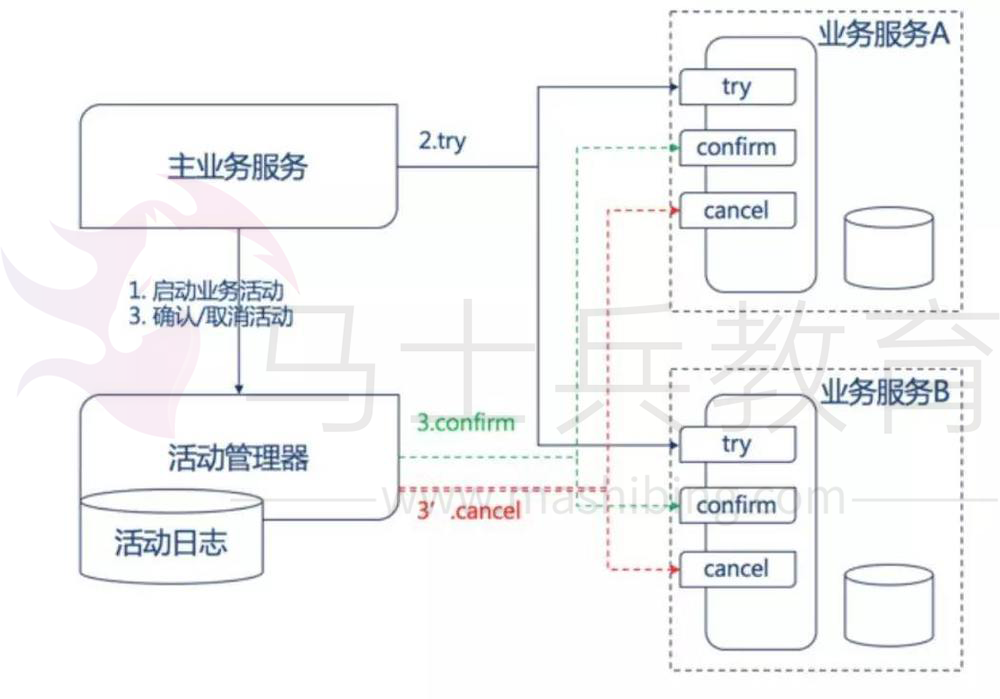
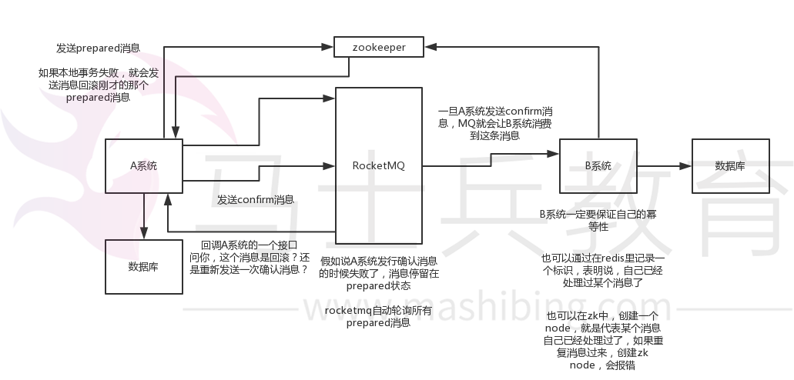
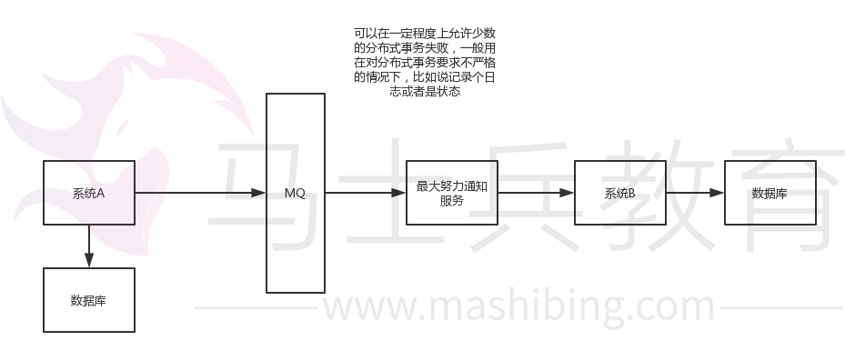

# 分布式事务解决方案


> 根据微服务架构的鼻祖 Martin Fowler 的忠告，微服务架构中应当尽量避免分布式事务。

> 分布式事务的讨论主要聚焦于强一致性和最终一致性的解决方案。

## 微服务的发展

微服务倡导将复杂的单体应用拆分为若干个功能简单、松耦合的服务，这样可以降低开发难度、增强扩展性、便于敏捷开发。当前被越来越多的开发者推崇，很多互联网行业巨头、开源社区等都开始了微服务的讨论和实践。

## 微服务落地存在的问题

虽然微服务现在如火如荼，但对其实践其实仍处于探索阶段。很多中小型互联网公司，鉴于经验、技术实力等问题，微服务落地比较困难。

如著名架构师Chris Richardson所言，目前存在的主要困难有如下几方面：

- 单体应用拆分为分布式系统后，进程间的通讯机制和故障处理措施变的更加复杂。
- 系统微服务化后，一个看似简单的功能，内部可能需要调用多个服务并操作多个数据库实现，服务调用的分布式事务问题变的非常突出。
- 微服务数量众多，其测试、部署、监控等都变的更加困难。

随着RPC框架的成熟，第一个问题已经逐渐得到解决。例如springcloud可以非常好的支持restful调用，dubbo可以支持多种通讯协议。

对于第三个问题，随着docker、devops技术的发展以及各公有云paas平台自动化运维工具的推出，微服务的测试、部署与运维会变得越来越容易。

而对于第二个问题，现在还没有通用方案很好的解决微服务产生的事务问题。分布式事务已经成为微服务落地最大的阻碍，也是最具挑战性的一个技术难题。

## ACID

- **原子性（Atomicity）:**  一个事务的所有系列操作步骤被看成是一个动作，所有的步骤要么全部完成要么一个也不会完成，如果事务过程中任何一点失败，将要被改变的数据库记录就不会被真正被改变。
- **一致性（Consistency）:**  数据库的约束 级联和触发机制Trigger都必须满足事务的一致性。也就是说，通过各种途径包括外键约束等任何写入数据库的数据都是有效的，不能发生表与表之间存在外键约束，但是有数据却违背这种约束性。所有改变数据库数据的动作事务必须完成，没有事务会创建一个无效数据状态，这是不同于CAP理论的一致性"consistency".
- **隔离性（Isolation）:**  主要用于实现并发控制, 隔离能够确保并发执行的事务能够顺序一个接一个执行，通过隔离，一个未完成事务不会影响另外一个未完成事务。
- **持久性（Durability）:**  一旦一个事务被提交，它应该持久保存，不会因为和其他操作冲突而取消这个事务。很多人认为这意味着事务是持久在磁盘上，但是规范没有特别定义这点。

## 一致性理论

分布式事务的目的是保障分库数据一致性，而跨库事务会遇到各种不可控制的问题，如个别节点永久性宕机，像单机事务一样的 ACID 是无法奢望的。

另外，业界著名的 CAP 理论也告诉我们，对分布式系统，需要将数据一致性和系统可用性、分区容忍性放在天平上一起考虑。

两阶段提交协议(简称2PC)是实现分布式事务较为经典的方案，但 2PC 的可扩展性很差，在分布式架构下应用代价较大，eBay 架构师 Dan Pritchett 提出了 BASE 理论，用于解决大规模分布式系统下的数据一致性问题。

BASE 理论告诉我们：可以通过放弃系统在每个时刻的强一致性来换取系统的可扩展性。

## CAP 理论

在分布式系统中，一致性(Consistency)、可用性(Availability)和分区容忍性(Partition Tolerance)3 个要素最多只能同时满足两个，不可兼得。其中，分区容忍性又是不可或缺的。



- 一致性：分布式环境下，多个节点的数据是否强一致。
- 可用性：分布式服务能一直保证可用状态。当用户发出一个请求后，服务能在有限时间内返回结果。
- 分区容忍性：特指对网络分区的容忍性。

举例：Cassandra、Dynamo 等，默认优先选择 AP，弱化 C;HBase、MongoDB 等，默认优先选择 CP，弱化 A。

## BASE 理论

核心思想：

- 基本可用(**B**asically **A**vailable)：指分布式系统在出现故障时，允许损失部分的可用性来保证核心可用；
- 软状态(**S**oft state)：指允许分布式系统存在中间状态，该中间状态不会影响到系统的整体可用性；
- 最终一致性(**E**ventual consistency)：指分布式系统中的所有副本数据经过一定时间后，最终能够达到一致的状态；
- 原子性（A）与持久性（D）必须根本保障；
- 为了可用性、性能与降级服务的需要，只有降低一致性( C ) 与 隔离性( I ) 的要求；
- 酸碱平衡(ACID-BASE Balance)；

BASE 是对 CAP 中 AP 的一个扩展

## 一致性模型

数据的一致性模型可以分成以下三类：

- 强一致性：数据更新成功后，任意时刻所有副本中的数据都是一致的，一般采用同步的方式实现。
- 弱一致性：数据更新成功后，系统不承诺立即可以读到最新写入的值，也不承诺具体多久之后可以读到。
- 最终一致性：弱一致性的一种形式，数据更新成功后，系统不承诺立即可以返回最新写入的值，但是保证最终会返回上一次更新操作的值。

分布式系统数据的强一致性、弱一致性和最终一致性可以通过 Quorum NRW 算法分析。

## 本地事务




- 在单个数据库的本地并且限制在单个进程内的事务
- 本地事务不涉及多个数据来源

## 分布式事务典型方案

- 两阶段提交（2PC, Two Phase Commit）方案；
- 本地消息表 （eBay 事件队列方案）；
- TCC 补偿模式；

分类：

- 两阶段型
- 补偿型
- 异步确保型
- 最大努力通知型

服务模式：

- 可查询操作
- 幂等操作
- TCC操作
- 可补偿操作

## 两阶段提交2PC（强一致性）

基于XA协议的两阶段提交:

- 第一阶段是表决阶段，所有参与者都将本事务能否成功的信息反馈发给协调者；
- 第二阶段是执行阶段，协调者根据所有参与者的反馈，通知所有参与者，步调一致地在所有分支上提交或者回滚;



缺点：

- 单点问题：事务管理器在整个流程中扮演的角色很关键，如果其宕机，比如在第一阶段已经完成，在第二阶段正准备提交的时候事务管理器宕机，资源管理器就会一直阻塞，导致数据库无法使用。
- 同步阻塞：在准备就绪之后，资源管理器中的资源一直处于阻塞，直到提交完成，释放资源。
- 数据不一致：两阶段提交协议虽然为分布式数据强一致性所设计，但仍然存在数据不一致性的可能。比如：在第二阶段中，假设协调者发出了事务 Commit 的通知，但是因为网络问题该通知仅被一部分参与者所收到并执行了 Commit 操作，其余的参与者则因为没有收到通知一直处于阻塞状态，这时候就产生了数据的不一致性。

总的来说，XA 协议比较简单，成本较低，但是其单点问题，以及不能支持高并发(由于同步阻塞)依然是其最大的弱点。

## 本地消息表（最终一致性）

eBay 的架构师 Dan Pritchett，曾在一篇解释 BASE 原理的论文《Base：An Acid Alternative》中提到一个 eBay 分布式系统一致性问题的解决方案。



它的核心思想是将需要分布式处理的任务通过消息或者日志的方式来异步执行，消息或日志可以存到本地文件、数据库或消息队列，再通过业务规则进行失败重试，它要求**各服务的接口是幂等**的。

本地消息表与业务数据表处于同一个数据库中，这样就能利用本地事务来保证在对这两个表的操作满足事务特性，并且使用了消息队列来保证最终一致性。

- 在分布式事务操作的一方完成写业务数据的操作之后向本地消息表发送一个消息，本地事务能保证这个消息一定会被写入本地消息表中；
- 之后将本地消息表中的消息转发到 Kafka 等消息队列中，如果转发成功则将消息从本地消息表中删除，否则继续重新转发；
- 消息消费方处理这个消息，并完成自己的业务逻辑。此时如果本地事务处理成功，表明已经处理成功了，如果处理失败，那么就会重试执行。如果是业务上面的失败，可以给生产方发送一个业务补偿消息，通知生产方进行回滚等操作；

**优点：** 一种非常经典的实现，避免了分布式事务，实现了最终一致性。

**缺点：** 消息表会耦合到业务系统中，如果没有封装好的解决方案，会有很多杂活需要处理。

这个方案的核心在于第二阶段的重试和幂等执行。失败后重试，这是一种补偿机制，它是能保证系统最终一致的关键流程。

### 可靠消息的最终一致性代码示例

表结构


```php
DROP TABLE IF EXISTS `rp_transaction_message`;

CREATE TABLE `rp_transaction_message` (
    `id` VARCHAR (50) NOT NULL DEFAULT '' COMMENT '主键ID',
    `version` INT (11) NOT NULL DEFAULT '0' COMMENT '版本号',
    `editor` VARCHAR (100) DEFAULT NULL COMMENT '修改者',
    `creater` VARCHAR (100) DEFAULT NULL COMMENT '创建者',
    `edit_time` datetime DEFAULT NULL COMMENT '最后修改时间',
    `create_time` datetime NOT NULL DEFAULT '0000-00-00 00:00:00' COMMENT '创建时间',
    `message_id` VARCHAR (50) NOT NULL DEFAULT '' COMMENT '消息ID',
    `message_body` LONGTEXT NOT NULL COMMENT '消息内容',
    `message_data_type` VARCHAR (50) DEFAULT NULL COMMENT '消息数据类型',
    `consumer_queue` VARCHAR (100) NOT NULL DEFAULT '' COMMENT '消费队列',
    `message_send_times` SMALLINT (6) NOT NULL DEFAULT '0' COMMENT '消息重发次数',
    `areadly_dead` VARCHAR (20) NOT NULL DEFAULT '' COMMENT '是否死亡',
    `status` VARCHAR (20) NOT NULL DEFAULT '' COMMENT '状态',
    `remark` VARCHAR (200) DEFAULT NULL COMMENT '备注',
    `field1` VARCHAR (200) DEFAULT NULL COMMENT '扩展字段1',
    `field2` VARCHAR (200) DEFAULT NULL COMMENT '扩展字段2',
    `field3` VARCHAR (200) DEFAULT NULL COMMENT '扩展字段3',
    PRIMARY KEY (`id`),
    KEY `AK_Key_2` (`message_id`)
) ENGINE = INNODB DEFAULT CHARSET = utf8;
```


```csharp
public interface RpTransactionMessageService {
    
    /**
     * 预存储消息.
     */
    public int saveMessageWaitingConfirm(RpTransactionMessage rpTransactionMessage) throws MessageBizException;

    /**
     * 确认并发送消息.
     */
    public void confirmAndSendMessage(String messageId) throws MessageBizException;

    /**
     * 存储并发送消息.
     */
    public int saveAndSendMessage(RpTransactionMessage rpTransactionMessage) throws MessageBizException;

    /**
     * 直接发送消息.
     */
    public void directSendMessage(RpTransactionMessage rpTransactionMessage) throws MessageBizException;

    /**
     * 重发消息.
     */
    public void reSendMessage(RpTransactionMessage rpTransactionMessage) throws MessageBizException;

    /**
     * 根据messageId重发某条消息.
     */
    public void reSendMessageByMessageId(String messageId) throws MessageBizException;

    /**
     * 将消息标记为死亡消息.
     */
    public void setMessageToAreadlyDead(String messageId) throws MessageBizException;

    /**
     * 根据消息ID获取消息
     */
    public RpTransactionMessage getMessageByMessageId(String messageId) throws MessageBizException;

    /**
     * 根据消息ID删除消息
     */
    public void deleteMessageByMessageId(String messageId) throws MessageBizException;

    /**
     * 重发某个消息队列中的全部已死亡的消息.
     */
    public void reSendAllDeadMessageByQueueName(String queueName, int batchSize) throws MessageBizException;

    /**
     * 获取分页数据
     */
    PageBean listPage(PageParam pageParam, Map<String, Object> paramMap) throws MessageBizException;
    
}
```


```java
@Service("rpTransactionMessageService")
public class RpTransactionMessageServiceImpl implements RpTransactionMessageService {
    
    private static final Log log = LogFactory.getLog(RpTransactionMessageServiceImpl.class);
    
    @Autowired
    private RpTransactionMessageDao rpTransactionMessageDao;
    
    @Autowired
    private JmsTemplate notifyJmsTemplate;

    public int saveMessageWaitingConfirm(RpTransactionMessage message) {
        if (message == null) {
            throw new MessageBizException(MessageBizException.SAVA_MESSAGE_IS_NULL, "保存的消息为空");
        }
        if (StringUtil.isEmpty(message.getConsumerQueue())) {
            throw new MessageBizException(MessageBizException.MESSAGE_CONSUMER_QUEUE_IS_NULL, "消息的消费队列不能为空 ");
        }
        message.setEditTime(new Date());
        message.setStatus(MessageStatusEnum.WAITING_CONFIRM.name());
        message.setAreadlyDead(PublicEnum.NO.name());
        message.setMessageSendTimes(0);
        return rpTransactionMessageDao.insert(message);
    }

    public void confirmAndSendMessage(String messageId) {
        final RpTransactionMessage message = getMessageByMessageId(messageId);
        if (message == null) {
            throw new MessageBizException(MessageBizException.SAVA_MESSAGE_IS_NULL, "根据消息id查找的消息为空");
        }
        message.setStatus(MessageStatusEnum.SENDING.name());
        message.setEditTime(new Date());
        rpTransactionMessageDao.update(message);
        notifyJmsTemplate.setDefaultDestinationName(message.getConsumerQueue());
        notifyJmsTemplate.send(new MessageCreator() {
            public Message createMessage(Session session) throws JMSException {
                return session.createTextMessage(message.getMessageBody());
            }
        });
    }

    public int saveAndSendMessage(final RpTransactionMessage message) {
        if (message == null) {
            throw new MessageBizException(MessageBizException.SAVA_MESSAGE_IS_NULL, "保存的消息为空");
        }
        if (StringUtil.isEmpty(message.getConsumerQueue())) {
            throw new MessageBizException(MessageBizException.MESSAGE_CONSUMER_QUEUE_IS_NULL, "消息的消费队列不能为空 ");
        }
        message.setStatus(MessageStatusEnum.SENDING.name());
        message.setAreadlyDead(PublicEnum.NO.name());
        message.setMessageSendTimes(0);
        message.setEditTime(new Date());
        int result = rpTransactionMessageDao.insert(message);
        notifyJmsTemplate.setDefaultDestinationName(message.getConsumerQueue());
        notifyJmsTemplate.send(new MessageCreator() {
            public Message createMessage(Session session) throws JMSException {
                return session.createTextMessage(message.getMessageBody());
            }
        });
        return result;
    }

    public void directSendMessage(final RpTransactionMessage message) {
        if (message == null) {
            throw new MessageBizException(MessageBizException.SAVA_MESSAGE_IS_NULL, "保存的消息为空");
        }
        if (StringUtil.isEmpty(message.getConsumerQueue())) {
            throw new MessageBizException(MessageBizException.MESSAGE_CONSUMER_QUEUE_IS_NULL, "消息的消费队列不能为空 ");
        }
        notifyJmsTemplate.setDefaultDestinationName(message.getConsumerQueue());
        notifyJmsTemplate.send(new MessageCreator() {
            public Message createMessage(Session session) throws JMSException {
                return session.createTextMessage(message.getMessageBody());
            }
        });
    }

    public void reSendMessage(final RpTransactionMessage message) {
        if (message == null) {
            throw new MessageBizException(MessageBizException.SAVA_MESSAGE_IS_NULL, "保存的消息为空");
        }
        if (StringUtil.isEmpty(message.getConsumerQueue())) {
            throw new MessageBizException(MessageBizException.MESSAGE_CONSUMER_QUEUE_IS_NULL, "消息的消费队列不能为空 ");
        }
        message.addSendTimes();
        message.setEditTime(new Date());
        rpTransactionMessageDao.update(message);
        notifyJmsTemplate.setDefaultDestinationName(message.getConsumerQueue());
        notifyJmsTemplate.send(new MessageCreator() {
            public Message createMessage(Session session) throws JMSException {
                return session.createTextMessage(message.getMessageBody());
            }
        });
    }

    public void reSendMessageByMessageId(String messageId) {
        final RpTransactionMessage message = getMessageByMessageId(messageId);
        if (message == null) {
            throw new MessageBizException(MessageBizException.SAVA_MESSAGE_IS_NULL, "根据消息id查找的消息为空");
        }
        int maxTimes = Integer.valueOf(PublicConfigUtil.readConfig("message.max.send.times"));
        if (message.getMessageSendTimes() >= maxTimes) {
            message.setAreadlyDead(PublicEnum.YES.name());
        }
        message.setEditTime(new Date());
        message.setMessageSendTimes(message.getMessageSendTimes() + 1);
        rpTransactionMessageDao.update(message);
        notifyJmsTemplate.setDefaultDestinationName(message.getConsumerQueue());
        notifyJmsTemplate.send(new MessageCreator() {
            public Message createMessage(Session session) throws JMSException {
                return session.createTextMessage(message.getMessageBody());
            }
        });
    }

    public void setMessageToAreadlyDead(String messageId) {
        RpTransactionMessage message = getMessageByMessageId(messageId);
        if (message == null) {
            throw new MessageBizException(MessageBizException.SAVA_MESSAGE_IS_NULL, "根据消息id查找的消息为空");
        }
        message.setAreadlyDead(PublicEnum.YES.name());
        message.setEditTime(new Date());
        rpTransactionMessageDao.update(message);
    }

    public RpTransactionMessage getMessageByMessageId(String messageId) {
        Map<String, Object> paramMap = new HashMap<String, Object>();
        paramMap.put("messageId", messageId);
        return rpTransactionMessageDao.getBy(paramMap);
    }

    public void deleteMessageByMessageId(String messageId) {
        Map<String, Object> paramMap = new HashMap<String, Object>();
        paramMap.put("messageId", messageId);
        rpTransactionMessageDao.delete(paramMap);
    }

    @SuppressWarnings("unchecked")
    public void reSendAllDeadMessageByQueueName(String queueName, int batchSize) {
        log.info("==>reSendAllDeadMessageByQueueName");
        int numPerPage = 1000;
        if (batchSize > 0 && batchSize < 100) {
            numPerPage = 100;
        } else if (batchSize > 100 && batchSize < 5000) {
            numPerPage = batchSize;
        } else if (batchSize > 5000) {
            numPerPage = 5000;
        } else {
            numPerPage = 1000;
        }
        int pageNum = 1;
        Map<String, Object> paramMap = new HashMap<String, Object>();
        paramMap.put("consumerQueue", queueName);
        paramMap.put("areadlyDead", PublicEnum.YES.name());
        paramMap.put("listPageSortType", "ASC");
        Map<String, RpTransactionMessage> messageMap = new HashMap<String, RpTransactionMessage>();
        List<Object> recordList = new ArrayList<Object>();
        int pageCount = 1;
        PageBean pageBean = rpTransactionMessageDao.listPage(new PageParam(pageNum, numPerPage), paramMap);
        recordList = pageBean.getRecordList();
        if (recordList == null || recordList.isEmpty()) {
            log.info("==>recordList is empty");
            return;
        }
        pageCount = pageBean.getTotalPage();
        for (final Object obj : recordList) {
            final RpTransactionMessage message = (RpTransactionMessage) obj;
            messageMap.put(message.getMessageId(), message);
        }
        for (pageNum = 2; pageNum <= pageCount; pageNum++) {
            pageBean = rpTransactionMessageDao.listPage(new PageParam(pageNum, numPerPage), paramMap);
            recordList = pageBean.getRecordList();
            if (recordList == null || recordList.isEmpty()) {
                break;
            }
            for (final Object obj : recordList) {
                final RpTransactionMessage message = (RpTransactionMessage) obj;
                messageMap.put(message.getMessageId(), message);
            }
        }
        recordList = null;
        pageBean = null;
        for (Map.Entry<String, RpTransactionMessage> entry : messageMap.entrySet()) {
            final RpTransactionMessage message = entry.getValue();
            message.setEditTime(new Date());
            message.setMessageSendTimes(message.getMessageSendTimes() + 1);
            rpTransactionMessageDao.update(message);
            notifyJmsTemplate.setDefaultDestinationName(message.getConsumerQueue());
            notifyJmsTemplate.send(new MessageCreator() {
                public Message createMessage(Session session) throws JMSException {
                    return session.createTextMessage(message.getMessageBody());
                }
            });
        }
    }

    @SuppressWarnings("unchecked")
    public PageBean<RpTransactionMessage> listPage(PageParam pageParam, Map<String, Object> paramMap) {
        return rpTransactionMessageDao.listPage(pageParam, paramMap);
    }
    
}
```


```cpp
@Component("messageBiz")
public class MessageBiz {

    private static final Log log = LogFactory.getLog(MessageBiz.class);

    @Autowired
    private RpTradePaymentQueryService rpTradePaymentQueryService;

    @Autowired
    private RpTransactionMessageService rpTransactionMessageService;

    /**
     * 处理[waiting_confirm]状态的消息
     * @param messages
     */
    public void handleWaitingConfirmTimeOutMessages(Map<String, RpTransactionMessage> messageMap) {
        log.debug("开始处理[waiting_confirm]状态的消息,总条数[" + messageMap.size() + "]");
        // 单条消息处理（目前该状态的消息，消费队列全部是accounting，如果后期有业务扩充，需做队列判断，做对应的业务处理。）
        for (Map.Entry<String, RpTransactionMessage> entry : messageMap.entrySet()) {
            RpTransactionMessage message = entry.getValue();
            try {
                log.debug("开始处理[waiting_confirm]消息ID为[" + message.getMessageId() + "]的消息");
                String bankOrderNo = message.getField1();
                RpTradePaymentRecord record = rpTradePaymentQueryService.getRecordByBankOrderNo(bankOrderNo);
                // 如果订单成功，把消息改为待处理，并发送消息
                if (TradeStatusEnum.SUCCESS.name().equals(record.getStatus())) {
                    // 确认并发送消息
                    rpTransactionMessageService.confirmAndSendMessage(message.getMessageId());
                } else if (TradeStatusEnum.WAITING_PAYMENT.name().equals(record.getStatus())) {
                    // 订单状态是等到支付，可以直接删除数据
                    log.debug("订单没有支付成功,删除[waiting_confirm]消息id[" + message.getMessageId() + "]的消息");
                    rpTransactionMessageService.deleteMessageByMessageId(message.getMessageId());
                }
                log.debug("结束处理[waiting_confirm]消息ID为[" + message.getMessageId() + "]的消息");
            } catch (Exception e) {
                log.error("处理[waiting_confirm]消息ID为[" + message.getMessageId() + "]的消息异常：", e);
            }
        }
    }

    /**
     * 处理[SENDING]状态的消息
     * @param messages
     */
    public void handleSendingTimeOutMessage(Map<String, RpTransactionMessage> messageMap) {
        SimpleDateFormat sdf = new SimpleDateFormat("yyyy-MM-dd HH:mm:ss");
        log.debug("开始处理[SENDING]状态的消息,总条数[" + messageMap.size() + "]");
        // 根据配置获取通知间隔时间
        Map<Integer, Integer> notifyParam = getSendTime();
        // 单条消息处理
        for (Map.Entry<String, RpTransactionMessage> entry : messageMap.entrySet()) {
            RpTransactionMessage message = entry.getValue();
            try {
                log.debug("开始处理[SENDING]消息ID为[" + message.getMessageId() + "]的消息");
                // 判断发送次数
                int maxTimes = Integer.valueOf(PublicConfigUtil.readConfig("message.max.send.times"));
                log.debug("[SENDING]消息ID为[" + message.getMessageId() + "]的消息,已经重新发送的次数[" 
                        + message.getMessageSendTimes() + "]");
                // 如果超过最大发送次数直接退出
                if (maxTimes < message.getMessageSendTimes()) {
                    // 标记为死亡
                    rpTransactionMessageService.setMessageToAreadlyDead(message.getMessageId());
                    continue;
                }
                // 判断是否达到发送消息的时间间隔条件
                int reSendTimes = message.getMessageSendTimes();
                int times = notifyParam.get(reSendTimes == 0 ? 1 : reSendTimes);
                long currentTimeInMillis = Calendar.getInstance().getTimeInMillis();
                long needTime = currentTimeInMillis - times * 60 * 1000;
                long hasTime = message.getEditTime().getTime();
                // 判断是否达到了可以再次发送的时间条件
                if (hasTime > needTime) {
                    log.debug("currentTime[" + sdf.format(new Date()) + "],[SENDING]消息上次发送时间[" 
                            + sdf.format(message.getEditTime()) + "],必须过了[" + times + "]分钟才可以再发送。");
                    continue;
                }
                // 重新发送消息
                rpTransactionMessageService.reSendMessage(message);
                log.debug("结束处理[SENDING]消息ID为[" + message.getMessageId() + "]的消息");
            } catch (Exception e) {
                log.error("处理[SENDING]消息ID为[" + message.getMessageId() + "]的消息异常：", e);
            }
        }
    }

    /**
     * 根据配置获取通知间隔时间
     * @return
     */
    private Map<Integer, Integer> getSendTime() {
        Map<Integer, Integer> notifyParam = new HashMap<Integer, Integer>();
        notifyParam.put(1, Integer.valueOf(PublicConfigUtil.readConfig("message.send.1.time")));
        notifyParam.put(2, Integer.valueOf(PublicConfigUtil.readConfig("message.send.2.time")));
        notifyParam.put(3, Integer.valueOf(PublicConfigUtil.readConfig("message.send.3.time")));
        notifyParam.put(4, Integer.valueOf(PublicConfigUtil.readConfig("message.send.4.time")));
        notifyParam.put(5, Integer.valueOf(PublicConfigUtil.readConfig("message.send.5.time")));
        return notifyParam;
    }

}
```


```java
public class AccountingMessageListener implements SessionAwareMessageListener<Message> {

    private static final Log LOG = LogFactory.getLog(AccountingMessageListener.class);

    /**
     * 会计队列模板(由Spring创建并注入进来)
     */
    @Autowired
    private JmsTemplate notifyJmsTemplate;

    @Autowired
    private RpAccountingVoucherService rpAccountingVoucherService;

    @Autowired
    private RpTransactionMessageService rpTransactionMessageService;

    public synchronized void onMessage(Message message, Session session) {
        RpAccountingVoucher param = null;
        String strMessage = null;
        try {
            ActiveMQTextMessage objectMessage = (ActiveMQTextMessage) message;
            strMessage = objectMessage.getText();
            LOG.info("strMessage1 accounting:" + strMessage);
            param = JSONObject.parseObject(strMessage, RpAccountingVoucher.class);
            // 这里转换成相应的对象还有问题
            if (param == null) {
                LOG.info("param参数为空");
                return;
            }
            int entryType = param.getEntryType();
            double payerChangeAmount = param.getPayerChangeAmount();
            String voucherNo = param.getVoucherNo();
            String payerAccountNo = param.getPayerAccountNo();
            int fromSystem = param.getFromSystem();
            int payerAccountType = 0;
            if (param.getPayerAccountType() != null && !param.getPayerAccountType().equals("")) {
                payerAccountType = param.getPayerAccountType();
            }
            double payerFee = param.getPayerFee();
            String requestNo = param.getRequestNo();
            double bankChangeAmount = param.getBankChangeAmount();
            double receiverChangeAmount = param.getReceiverChangeAmount();
            String receiverAccountNo = param.getReceiverAccountNo();
            String bankAccount = param.getBankAccount();
            String bankChannelCode = param.getBankChannelCode();
            double profit = param.getProfit();
            double income = param.getIncome();
            double cost = param.getCost();
            String bankOrderNo = param.getBankOrderNo();
            int receiverAccountType = 0;
            double payAmount = param.getPayAmount();
            if (param.getReceiverAccountType() != null && !param.getReceiverAccountType().equals("")) {
                receiverAccountType = param.getReceiverAccountType();
            }
            double receiverFee = param.getReceiverFee();
            String remark = param.getRemark();
            rpAccountingVoucherService.createAccountingVoucher(entryType, voucherNo, payerAccountNo, receiverAccountNo, 
                    payerChangeAmount, receiverChangeAmount, income, cost, profit, bankChangeAmount, requestNo, 
                    bankChannelCode, bankAccount, fromSystem, remark, bankOrderNo, payerAccountType, payAmount, 
                    receiverAccountType, payerFee, receiverFee);
            //删除消息
            rpTransactionMessageService.deleteMessageByMessageId(param.getMessageId());
        } catch (BizException e) {
            // 业务异常，不再写会队列
            LOG.error("==>BizException", e);
        } catch (Exception e) {
            // 不明异常不再写会队列
            LOG.error("==>Exception", e);
        }
    }

    public JmsTemplate getNotifyJmsTemplate() {
        return notifyJmsTemplate;
    }

    public void setNotifyJmsTemplate(JmsTemplate notifyJmsTemplate) {
        this.notifyJmsTemplate = notifyJmsTemplate;
    }

    public RpAccountingVoucherService getRpAccountingVoucherService() {
        return rpAccountingVoucherService;
    }

    public void setRpAccountingVoucherService(RpAccountingVoucherService rpAccountingVoucherService) {
        this.rpAccountingVoucherService = rpAccountingVoucherService;
    }

}
```

### 与常规MQ的ACK机制对比

常规MQ确认机制：

- Producer生成消息并发送给MQ（同步、异步）；
- MQ接收消息并将消息数据持久化到消息存储（持久化操作为可选配置）；
- MQ向Producer返回消息的接收结果（返回值、异常）；
- Consumer监听并消费MQ中的消息；
- Consumer获取到消息后执行业务处理；
- Consumer对已成功消费的消息向MQ进行ACK确认（确认后的消息将从MQ中删除）；

常规MQ队列消息的处理流程无法实现**消息发送一致性**，因此直接使用现成的MQ中间件产品无法实现可靠消息最终一致性的分布式事务解决方案

**消息发送一致性：**是指产生消息的业务动作与消息发送的一致。也就是说，如果业务操作成功，那么由这个业务操作所产生的消息一定要成功投递出去(一般是发送到kafka、rocketmq、rabbitmq等消息中间件中)，否则就丢消息。

下面用伪代码进行演示消息发送和投递的不可靠性：

**先进行数据库操作，再发送消息：**


```cpp
public void test1(){
    //1 数据库操作
    //2 发送MQ消息
}
```

这种情况下无法保证数据库操作与发送消息的一致性，因为可能数据库操作成功，发送消息失败。

**先发送消息，再操作数据库：**


```cpp
public void test1(){
    //1 发送MQ消息
    //2 数据库操作
}
```

这种情况下无法保证数据库操作与发送消息的一致性，因为可能发送消息成功，数据库操作失败。

**在数据库事务中，先发送消息，后操作数据库：**


```java
@Transactional
public void test1(){
    //1 发送MQ消息
    //2 数据库操作
}
```

这里使用spring 的@Transactional注解，方法里面的操作都在一个事务中。同样无法保证一致性，因为发送消息成功了，数据库操作失败的情况下，数据库操作是回滚了，但是MQ消息没法进行回滚。

**在数据库事务中，先操作数据库，后发送消息：**


```java
@Transactional
public void test1(){
    //1 数据库操作
    //2 发送MQ消息
}
```

这种情况下，貌似没有问题，如果发送MQ消息失败，抛出异常，事务一定会回滚(加上了@Transactional注解后，spring方法抛出异常后，会自动进行回滚)。

这只是一个假象，因为发送MQ消息可能事实上已经成功，如果是响应超时导致的异常。这个时候，数据库操作依然回滚，但是MQ消息实际上已经发送成功，导致不一致。

**与消息发送一致性流程的对比：**

- 常规MQ队列消息的处理流程无法实现消息发送一致性；
- 投递消息的流程其实就是消息的消费流程，可细化；

## TCC (Try-Confirm-Cancel)补偿模式（最终一致性）

TCC 其实就是采用的补偿机制，其核心思想是：针对每个操作，都要注册一个与其对应的确认和补偿（撤销）操作。

它分为三个阶段：

- Try 阶段主要是对业务系统做检测及资源预留
- Confirm 阶段主要是对业务系统做确认提交，Try阶段执行成功并开始执行 Confirm阶段时，默认 Confirm阶段是不会出错的。即：只要Try成功，Confirm一定成功。
- Cancel 阶段主要是在业务执行错误，需要回滚的状态下执行的业务取消，预留资源释放。




举例（Bob 要向 Smith 转账）：

- 首先在 Try 阶段，要先调用远程接口把 Smith 和 Bob 的钱给冻结起来。
- 在 Confirm 阶段，执行远程调用的转账的操作，转账成功进行解冻。
- 如果第2步执行成功，那么转账成功，如果第二步执行失败，则调用远程冻结接口对应的解冻方法 (Cancel)。

**优点：**
 跟2PC比起来，实现以及流程相对简单了一些，但数据的一致性比2PC也要差一些

**缺点：**
 缺点还是比较明显的，在2,3步中都有可能失败。TCC属于应用层的一种补偿方式，所以需要程序员在实现的时候多写很多补偿的代码，在一些场景中，一些业务流程可能用TCC不太好定义及处理。

## 可靠消息最终一致（常用）

不要用本地的消息表了，直接基于MQ来实现事务。比如阿里的RocketMQ就支持消息事务。



大概流程：

- A系统先发送一个prepared消息到mq，如果这个prepared消息发送失败那么就直接取消操作别执行了
- 如果这个消息发送成功过了，那么接着执行本地事务，如果成功就告诉mq发送确认消息，如果失败就告诉mq回滚消息
- 如果发送了确认消息，那么此时B系统会接收到确认消息，然后执行本地的事务
- mq会自动定时轮询所有prepared消息回调你的接口，问你，这个消息是不是本地事务处理失败了，所有没发送确认消息？那是继续重试还是回滚？一般来说这里你就可以查下数据库看之前本地事务是否执行，如果回滚了，那么这里也回滚吧。这个就是避免可能本地事务执行成功了，别确认消息发送失败了。

这个方案里，要是系统B的事务失败了咋办？重试咯，自动不断重试直到成功，如果实在是不行，要么就是针对重要的资金类业务进行回滚，比如B系统本地回滚后，想办法通知系统A也回滚；或者是发送报警由人工来手工回滚和补偿

目前国内互联网公司大都是这么玩儿的，要不你使用RocketMQ支持的，要不你就基于其他MQ中间件自己封装一套类似的逻辑，总之思路就是这样的。

## 最大努力通知

业务发起方将协调服务的消息发送到MQ，下游服务接收此消息，如果处理失败，将进行重试，重试N次后依然失败，将不进行重试，放弃处理，这个应用场景要求对事物性要求不高的地方。




