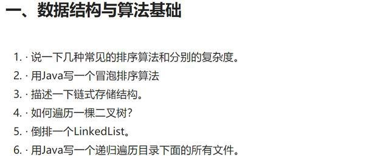
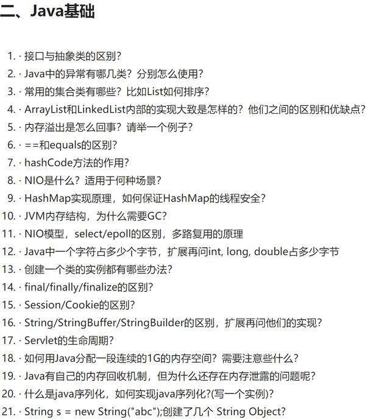
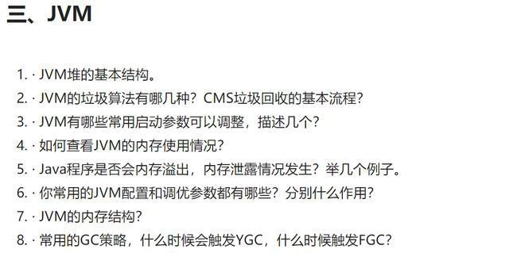
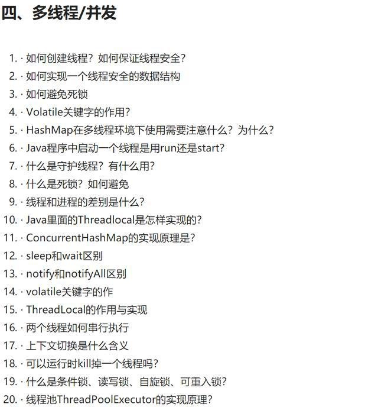
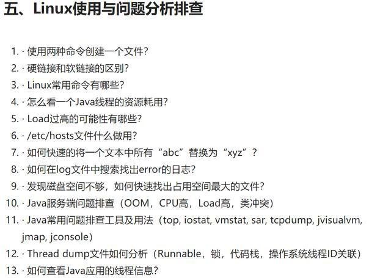
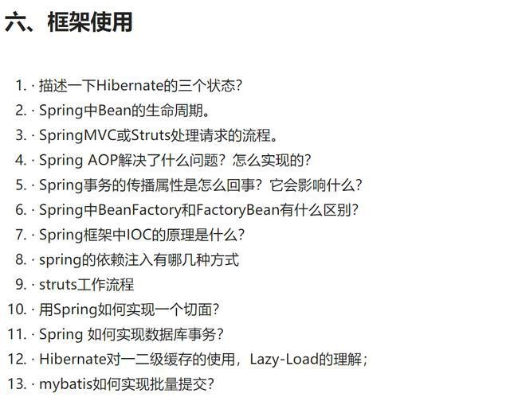
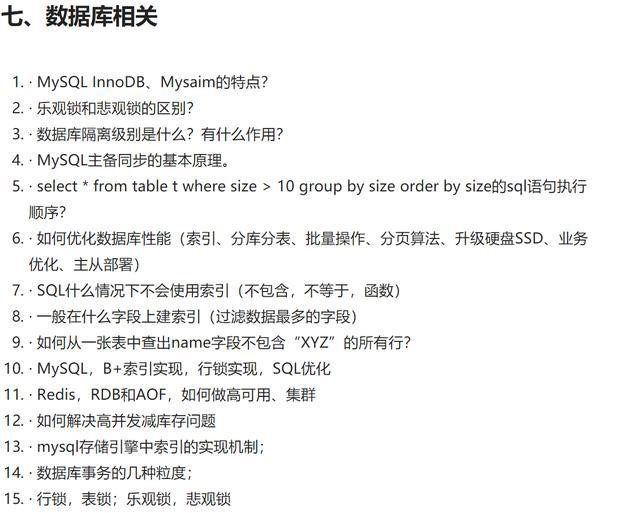
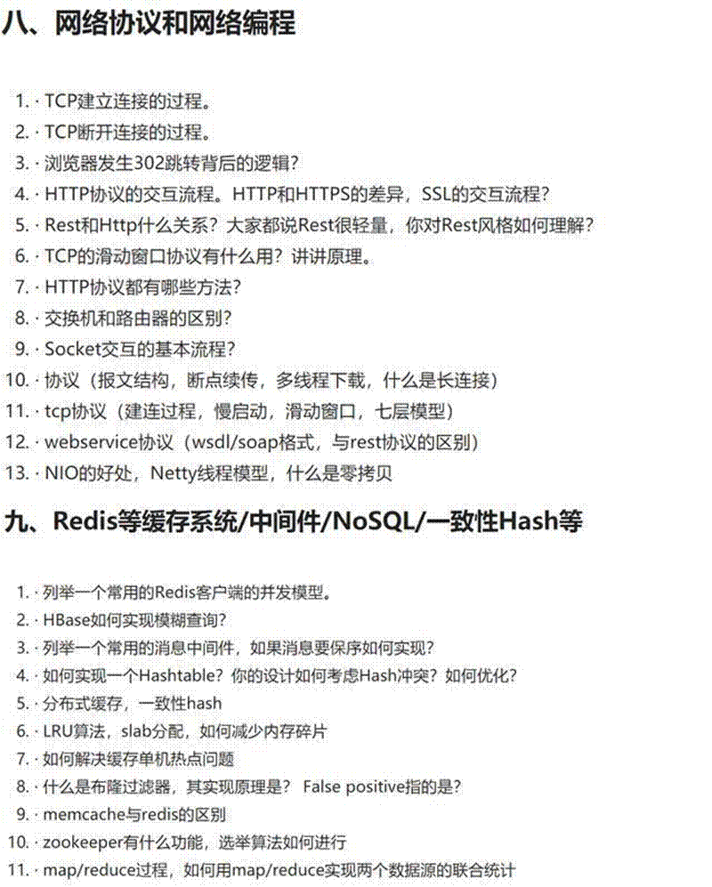
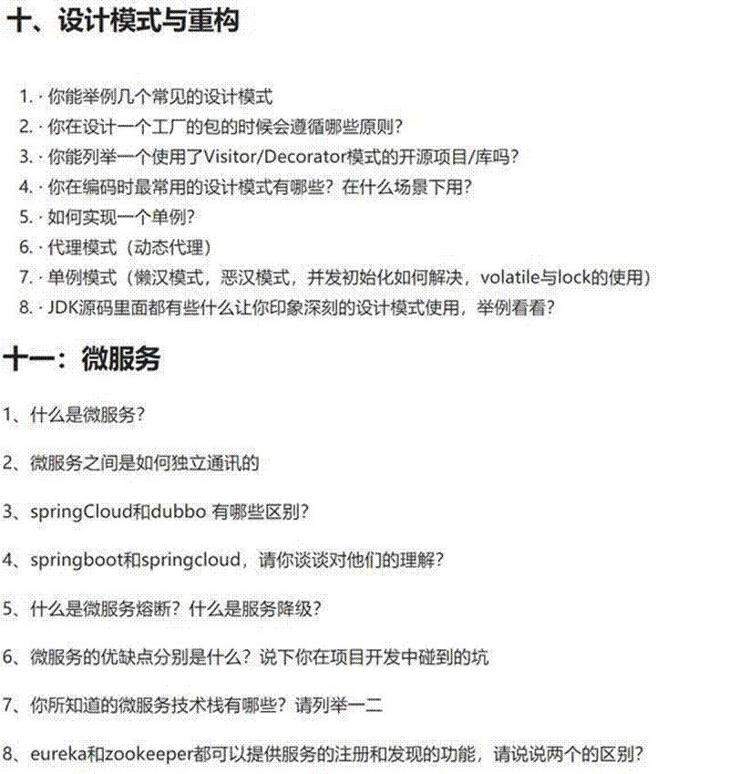

我们在操作数据库的时候，可能会由于并发问题而引起的数据的不一致性（数据冲突）。如何保证数据并发访问的一致性、有效性，是所有数据库必须解决的一个问题，锁的冲突也是影响数据库并发访问性能的一个重要因素，从这一角度来说，锁对于数据库而言就显得尤为重要。

MySQL 锁概述

相对其他数据库而言，MySQL 的锁机制比较简单，其最显著的特点是不同的存储引擎支持不同的锁机制。

比如：

MyISAM 和 MEMORY 存储引擎采用的是表级锁（table-level locking）；

InnoDB 存储引擎既支持行级锁（ row-level locking），也支持表级锁，但默认情况下是采用行级锁。

MySQL 主要的两种锁的特性可大致归纳如下:

阿里 P8 架构师谈：MySQL 行锁、表锁、悲观锁、乐观锁的特点与应用

表级锁：开销小，加锁快；不会出现死锁(因为 MyISAM 会一次性获得 SQL 所需的全部锁)；锁定粒度大，发生锁冲突的概率最高,并发度最低。

行级锁：开销大，加锁慢；会出现死锁；锁定粒度最小，发生锁冲突的概率最低,并发度也最高。

页锁：开销和加锁速度介于表锁和行锁之间；会出现死锁；锁定粒度介于表锁和行锁之间，并发度一般

行锁和表锁

1.主要是针对锁粒度划分的，一般分为：行锁、表锁、库锁

（1）行锁：访问数据库的时候，锁定整个行数据，防止并发错误。

（2）表锁：访问数据库的时候，锁定整个表数据，防止并发错误。

2.行锁和表锁的区别：

表锁：开销小，加锁快，不会出现死锁；锁定力度大，发生锁冲突概率高，并发度最低行锁：开销大，加锁慢，会出现死锁；锁定粒度小，发生锁冲突的概率低，并发度高悲观锁和乐观锁

（1）悲观锁：顾名思义，就是很悲观，每次去拿数据的时候都认为别人会修改，所以每次在拿数据的时候都会上锁，这样别人想拿这个数据就会 block 直到它拿到锁。

传统的关系型数据库里边就用到了很多这种锁机制，比如行锁，表锁等，读锁，写锁等，都是在做操作之前先上锁。

（2）乐观锁：顾名思义，就是很乐观，每次去拿数据的时候都认为别人不会修改，所以不会上锁，但是在更新的时候会判断一下在此期间别人有没有去更新这个数据，可以使用版本号等机制。乐观锁适用于多读的应用类型，这样可以提高吞吐量，像数据库如果提供类似于 write_condition 机制的其实都是提供的乐观锁。

（3）悲观锁和乐观锁的区别：

两种锁各有优缺点，不可认为一种好于另一种，像乐观锁适用于写比较少的情况下，即冲突真的很少发生的时候，这样可以省去了锁的开销，加大了系统的整个吞吐量。但如果经常产生冲突，上层应用会不断的进行 retry，这样反倒是降低了性能，所以这种情况下用悲观锁就比较合适。

共享锁共享锁指的就是对于多个不同的事务，对同一个资源共享同一个锁。相当于对于同一把门，它拥有多个钥匙一样。就像这样，你家有一个大门，大门的钥匙有好几把，你有一把，你女朋友有一把，你们都可能通过这把钥匙进入你们家，这个就是所谓的共享锁。

刚刚说了，对于悲观锁，一般数据库已经实现了，共享锁也属于悲观锁的一种，那么共享锁在 mysql 中是通过什么命令来调用呢。通过查询资料，了解到通过在执行语句后面加上 lock in share mode 就代表对某些资源加上共享锁了。

什么时候使用表锁

对于 InnoDB 表，在绝大部分情况下都应该使用行级锁，因为事务和行锁往往是我们之所以选择 InnoDB 表的理由。但在个别特殊事务中，也可以考虑使用表级锁。

第一种情况是：事务需要更新大部分或全部数据，表又比较大，如果使用默认的行锁，不仅这个事务执行效率低，而且可能造成其他事务长时间锁等待和锁冲突，这种情况下可以考虑使用表锁来提高该事务的执行速度。

第二种情况是：事务涉及多个表，比较复杂，很可能引起死锁，造成大量事务回滚。这种情况也可以考虑一次性锁定事务涉及的表，从而避免死锁、减少数据库因事务回滚带来的开销。

当然，应用中这两种事务不能太多，否则，就应该考虑使用 MyISAM 表了。

表锁和行锁应用场景：

表级锁使用与并发性不高，以查询为主，少量更新的应用，比如小型的 web 应用；

而行级锁适用于高并发环境下，对事务完整性要求较高的系统，如在线事务处理系统。

# **BAT**技术面试范围

.

数据结构与算法：最常见的各种排序，最好能手写

.

.

Java 高级：JVM 内存结构、垃圾回收器、回收算法、GC、并发编程相关(多

线程、线程池等)、NIO/BIO、各种集合类的比较优劣势(底层数据结构也要

掌握，特别是扩容等)等。

.

.

性能优化、设计模式、UML 的掌握

.

.

Spring 框架：重点掌握(BAT 每次必问)

.

.

分布式相关：Redis 缓存、一致 Hash 算法、分布式存储、负载均衡等。

.

.

微服务以及 Docker 容器等。

.

# 最全阿里面试题目

# 阿里面试总结

阿里的面试特别喜欢面试技术原理，特别是

. 多线程

. .

NIO

.

.

异步消息框架

.

.

分布式相关的缓存算法等

.

.

JVM 的加载过程和原理

回收算法

以及具体使用过的框架，会问部分参数检验你是否熟用

第一面能通过，后续被录用的可能性就比较高了，第一轮非常重要，建议系统性的学习面试题目！

以上就是完整的阿里技术面试题目、以及阿里面试经验总结，希望对你有所帮助！

一面：

HashMap 实现原理，ConcurrentHashMap 实现原理红黑树，为什么允许局部不平衡

TCP，UDP 区别，为什么可靠和不可靠

一次 HTTP 请求的全过程，包括域名解析、定位主机等

TCP 三次握手

MySQL 事务是什么？四大特性，四大隔离级别

ConcurrentHashMap 和 Hashtable 区别 spring IOC 和 AOP，以及各有什么优点有哪几种常用的线程池什么情况下使用 Runnable 和 Thread 创建线程，Runnable 和 Callable 的区别线程方法中的异常如何处理，副线程可以捕获到吗

synchronized 和锁的区别，什么情况下使用 synchronized 和 ReentrantLock

JVM 的对象分配在哪个区，Class 对象分配在哪个区二面：常用的设计模式介绍：单例模式、装饰者模式等

Java 会出现内存溢出吗？什么情况下会出现？双亲委派模型，为什么这样做？对象什么情况下进入老年代？快速排序说一下过程

AOP 实现原理：动态代理

BIO、NIO（如何实现的）、AIO

消息中间件有哪些？他们之间的优劣势？

Redis，持久化框架栈和队列

垃圾回收算法 MySQL 的索引

Tomcat 类加载器

OOM 内存泄漏，什么情况下会出现，如何排查三面：介绍你实践的性能优化案例，以及你的优化思路微服务和 SOA 的区别，优劣势

SQL 慢查询的优化方案，索引和表的优化方案。

MySQL 与 MongoDB 的区别，海量数据的存储缓存框架，例如 Redis、Memcached 之间的区别，优劣势比较请描述一致 hash 算法

分布式 session 的共享方案有哪些，有什么优劣势

高并发情况，系统的优化方案有哪些，以及优先级排序。

面试总结

一面：

ArrayList 和 linkedlist 区别。ArrayList 是否会越界。

ArrayList 和 hashset 有何区别。hashset 存的数是有序的么。

volatile 和 synchronized 区别多态的原理

数据库引擎 Innodb 和 myisam 区别

Redis 的数据结构

Redis 是基于内存的么

Redis 的 list zset 的底层实现

http 和 https 的区别，tcp 握手过程 jvm 垃圾回收算法手写冒泡

手写单例包括多线程下

Java 线程间怎么实现同步，notify()与 notifyAll()的区别数据库的悲观锁和乐观锁应用场景。

排序算法的复杂度，快速排序非递归实现。海量数据过滤，黑名单过滤一个 url。

二面：

list set map 底层使用什么实现的有哪些典型实现

hashmap 扩容是怎么扩容的，为什么是 2 的幂

concurrenthashmap 为什么线程安全，采用了什么措施应对高并发线程池的参数有什么意义

Springmvc 请求流程

Spring IOC，autowired 如何实现

Spring boot

SpringClound 的基本架构设计

Dubbo 和 SpringClound 的区别在哪里，优劣势说说一致性 Hash 算法三面：分布式架构设计哪方面比较熟悉

讲讲你对 CDN 的了解，与分布式缓存和本地缓存的区别多线程和高并发有什么区别高并发下有哪些常用的技术解决方案，举三个高并发场景设计例子

说一个你对 JVM 优化的实际案例，包括实际步骤和方法

Docker 有使用过和了解吗？Docker 和 JVM 的区别是什么？

Docker 的基本架构和使用场景？

负载均衡有接触过哪些开源框架，优劣势是什么？数据库分库分表需要怎样来实现？数据库端的常用优化策略？

如果让你来设计秒杀系统，你的设计思路是什么，为什么要这样设计？

面试总结：

java 的基础知识点，主要围绕在集合类和多线程等：ArrayList、LinkedList、HashSet、HashpMap 的数据结果，以及如何扩容、以及 ConcurrentHashMap 相关的多线程安全等。

JVM 的内存分配、几个常见的垃圾回收算法以及原理、还有对应的 JVM 优化参数需要牢记。

网络：TCP 的三次握手等网络都必问，重点掌握网络协议。

Redis：作为分布式缓存的主力，基本也是 BAT 每次必考，重点是 Redis 的数据结构、内存、算法、持久化，以及与别的缓存 memcached 的优劣势。

多线程：状态流转、多线程的实现，以及与高并发的区别等。

Spring 框架问得是最多的，BAT 非常喜欢问，重点掌握。

最后就是分布式架构设计

常用的分布式架构设计方案：单点登录、分布式缓存、存储、消息的选型，还有就是数据库端的优化方案(需要提前了解)。

最好能提前了解深入一个类似秒杀这样的项目，如果面试官问到类似的项目，你能把设计思路讲出来，这对你的面试结果是很大的加分项。

一面

1.自我介绍

2.谈一个你觉得你学到最多的项目，使用了什么技术，挑战在哪里

3.Spring 的 bean 的作用域？（比如：singleton，prototype 等）

4.Spring 的 IOC 实现原理？没有无参构造函数能实例化吗？有参构造函数注入？（xml 配置）

5.通过反射，谈到了方法区，然后，类加载机制？

6.synchronized 的实现原理？Volatile 能保证原子性吗？为什么？

7.hashmap 和 concurrenthashmap 的 size 方法怎么实现的

8.JVM 的调优参数？（-Xmn，-Xms 等具体参数设置）

9.线程池优点，参数，如果我想实现 newSingleThreadPoll，应该怎么配置，构造方法传什么参数

10.mysql 死锁，怎么解决，如果不要求执行顺序，死锁怎么解决

11.ioc 和 aop 原理

12.线程的五态？转化过程？

13.TCP 三次握手，为什么三次握手？

14.JVM 内存分区？（主存，工作内存，堆，栈。。。。）

15.讲一下 GC？

16.为什么要用老年代和新生代？

17.新生代进入老生代的情况？

18.新生代的分区？

二面变着法的问了一大堆线程池的知识（主要考对应的参数） java 内存模型

lock 和 synchronized 的区别 reentrantlock 的实现

hashmap 和 concurrenthashmap

B+树和 B-树的区别复合索引聚集索引和非聚集索引的区别？数据库索引主键和唯一索引有什么区别索引失效条件，什么时候该建立索引 innDB 和 MyISAM 的区别？

线程安全（阻塞同步，非阻塞同步，无同步）三面主要高并发和分布式架构设计

服务器模型以及之间的区别线程池的设计线程池如何做负载均衡如何实现线程调度算法复合索引是如何实现的？

如何设计单点登录，单点登录的原理

redis 缓存和 memcached 缓存的区别，以及各自的优劣势

大型高并发网站如何做性能优化：Web 性能、数据库性能、应用服务器性能等。

实践中如何优化 MySQL:SQL 语句及索引的优化、数据库表结构的优化、系统配置的优化、硬件的优化分库分表和读写分离如何设计

微服务架构：dubbo 和 springcloud 的区别，以及各自对应的使用场景。

淘宝一面: 面试介绍

1）   自我介绍？

2）   项目介绍？

3）   遇到的最大困难是什么？怎么解决的？

4）   你觉得你能怎么优化这个项目？

面试题目

1）  讲一下 JVM

2）  讲一下 JVM 的分代回收以及具体算法

3）  将一下 JVM 的垃圾收集器，G1 和 CMS 有啥区别？

4）  讲一下一个变量从产生到结束所经历的过程，讲一下字符串常量的过程？

5）  将一下线程安全问题产生的原因？

6）  讲一下乐观锁和悲观锁

7）  乐观锁是怎么保证一致性的

8）  Integer 和 int 有啥区别，integer 中有哪些特殊的函数？

9）  讲一下数据库的隔离等级

10） 说一下 MVCC

11） 说一聚簇索引和非聚簇索引的有什么不同

淘宝二面:

1、问了冒泡排序，快排，和归并排序及优缺点和优化

2，网络方面有 osi 七层，tcp/ip 五层，分别有哪些协议及作用

3，爬虫用的什么数据结构

4、tcp 的流量控制和拥塞控制

5，mysql 用的什么存储引擎，这个存储引擎用的什么数据结构，有哪些优缺点，怎么使用

6，jvm 的垃圾回收机制和垃圾收集器

7、  spring 当中事物的隔离级别

8、  jdk1.8 concurrenthashmap 的新的特性，有没有看过源码

9、  threadlocal 了解吗

10，问了 redis 的一些问题，项目中有(扩容，失效 key 清理策略等)

11，剩下的都是项目的东西(kafka filebeat elk 原理，主从选举，复制等)

12，后面扩展的问了一些大数据相关的，问我一些大数据处理框架是否有了解

整个过程四十分钟左右

淘宝三面主要项目，你做过哪些项目，用过哪些技术？了解哪些框架？你觉得对你技术提升最高的是哪一件事情，提升了你哪一方面的技术？

1）   讲一下 Spring AOP 和 IOC 的底层实现

2）   说一下 hashcode 的作用？HashMap 的底层实现？HashMap 和 HashTable 的区别 3）说一下 concurrentHashMap 和 hashTable 在性能上的区别？以及这种差异形成的原因

4）   讲一下堆以及堆排序

5）   说一下 B+tree 和二叉搜索树的区别？说一下二叉搜索树和 AVL 树、红黑树之间的差别

6）   给你两个文件（字符串形式的）如何找出他们之间的不同地方？

7）   你刚刚说的能怎么优化？

淘宝四面交叉面本来以为三面结束就是 hr 面了，又收到一面交叉面

\1. 给你 50 亿行字符串，机器 4G 内存（只能一台机器），找出重复次数最多的那行字符串？

（以行为单位，每行不超过 10 个字符）

2.设计一个算法，实现两个 10g 大文件在 10m 的内存中将两个大文件中重复的放进第三个文件

\3.     快速排序的平均复杂多少？最坏情况是什么？（这个题估计就是缓和一下尴尬的气氛）支付宝一面

\4.     介绍一下自己。

\5.     项目参与的核心设计有哪些

\6.     ArrayList 和 LinkedList 底层

\7.     HashMap 及线程安全的 ConcurrentHashMap，以及各自优劣势

\8.     Java 如何实现线程安全

\9.     Synchronized 和 Lock 哪个更好？

\10.   HashMap 中的 get()方法是如何实现的？

\11.   HashMap 可以用在哪些场景？

\12.   JVM，垃圾回收机制，内存划分等

\13.   SQL 优化，常用的索引？

\14.   还有什么问题需要问的。

\15.   支付宝二面

\16.   没有自我介绍，直接问做过哪些 Java 开发相关的项目。

\17.   对哪些技术比较熟悉？

\18.   多线程状态图，状态如何流转？

\19.   死锁，死锁原因

\20.   页锁、乐观锁、悲观锁？

\21.   乐观锁如何保证线程安全？

\22.   用过线程池吗，对应的好处，如何用？

\23.   两个 10G 的文件，里面是一些 url，内存只有 1G，如何将这两个文件合并，找到相同的 url？

\24.   1000 个多并发线程，10 台机器，每台机器 4 核的，设计线程池大小。

\25.   代码题：两个有序数组，数组中存在重复数字，合并成一个有序数组，去除重复数字。

\26.   说一下自己的优点。

\27.   支付宝三面

\28.   jvm 性能调优都做了什么

\29.   数据库性能调优如何做

\30.   分布式系统原理：CAP，最终一致性，幂等操作等

\31.   高并发情况下，我们系统是如何支撑大量的请求的

\32.   集群如何同步会话状态

\33.   常用 NOSQL，有做过比较?

\34.   什么情况会出现雪崩，以及如何应对？

\35.   负载均衡的原理 36. 数据库事务属性

| 支付宝一面               |                                                        |
| ------------------------ | ------------------------------------------------------ |
| . .                      | 介绍一下自己。  项目参与的核心设计有哪些               |
| .                        | ArrayList 和 LinkedList 底层                           |
| .                        | HashMap 及线程安全的 ConcurrentHashMap，以及各自优劣势 |
| .                        | Java 如何实现线程安全                                  |
| .                        | Synchronized 和 Lock 哪个更好？                        |
| .                        | HashMap 中的 get()方法是如何实现的？                   |
| .                        | HashMap 可以用在哪些场景？                             |
| .                        | JVM，垃圾回收机制，内存划分等                          |
| .                        | SQL 优化，常用的索引？                                 |
| . 还有什么问题需要问的。 |                                                        |
| 支付宝二面               |                                                        |

. 没有自我介绍，直接问做过哪些 Java 开发相关的项目。

. 对哪些技术比较熟悉？

. 多线程状态图，状态如何流转？

. 死锁，死锁原因

. 页锁、乐观锁、悲观锁？

. 乐观锁如何保证线程安全？

. 用过线程池吗，对应的好处，如何用？

. 两个 10G 的文件，里面是一些 url，内存只有 1G，如何将这两个文件合并，找到相同的 url？

​         . 1000 个多并发线程，10 台机器，每台机器 4 核的，设计线程池大小。

. 代码题：两个有序数组，数组中存在重复数字，合并成一个有序数组，

去除重复数字。

. 说一下自己的优点。

支付宝三面

​         .  jvm 性能调优都做了什么

. 数据库性能调优如何做

. 分布式系统原理：CAP，最终一致性，幂等操作等

. 高并发情况下，我们系统是如何支撑大量的请求的

. 集群如何同步会话状态

. 常用 NOSQL，有做过比较?

. 什么情况会出现雪崩，以及如何应对？

. 负载均衡的原理

. 数据库事务属性

美团内推（一面+二面+三面）面试题目

美团一面（电话）自我介绍项目介绍

Redis 介绍了解 redis 源码么了解 redis 集群么

Hashmap 的原理，增删的情况后端数据结构如何位移 hashmap 容量为什么是 2 的幂次 hashset 的源码

object 类你知道的方法 hashcode 和 equals

你重写过 hashcode 和 equals 么，要注意什么

假设现在一个学生类，有学号和姓名，我现在 hashcode 方法重写的时候，只将学号参与计算，会出现什么情况？

往 set 里面 put 一个学生对象，然后将这个学生对象的学号改了，再 put 进去，可以放进 set 么？并讲出为什么

Redis 的持久化？有哪些方式，原理是什么？讲一下稳定的排序算法和不稳定的排序算法讲一下快速排序的思想美团二面（现场）

自我介绍

讲一下数据的 acid 什么是一致性什么是隔离性

Mysql 的隔离级别

每个隔离级别是如何解决

Mysql 要加上 nextkey 锁，语句该怎么写

Java 的内存模型，垃圾回收线程池的参数每个参数解释一遍

然后面试官设置了每个参数，给了是个线程，让描述出完整的线程池执行的流程

Nio 和 IO 有什么区别

Nio 和 aio 的区别

Spring 的 aop 怎么实现

Spring 的 aop 有哪些实现方式动态代理的实现方式和区别

Linux 了解么

怎么查看系统负载

Cpu load 的参数如果为 4，描述一下现在系统处于什么情况

Linux，查找磁盘上最大的文件的命令

Linux，如何查看系统日志文件

手撕算法：leeetcode 原题 22，Generate Parentheses，给定 n 对括号，请写一个函数以将其生成新的括号组合，并返回所有组合结果。

美团三面（现场）三面没怎么问技术，问了很多技术管理方面的问题自我介绍项目介绍怎么管理项目成员当意见不一致时，如何沟通并说服开发成员，并举个例子怎么保证项目的进度数据库的索引原理非聚簇索引和聚簇索引索引的使用注意事项联合索引从底层解释最左匹配原则

Mysql 对联合索引有优化么？会自动调整顺序么？哪个版本开始优化？

Redis 的应用

Redis 的持久化的方式和原理

技术选型，一个新技术和一个稳定的旧技术，你会怎么选择，选择的考虑有哪些说你印象最深的美团点评技术团队的三篇博客最近在学什么新技术

美团内推（一面**+**二面**+**三面）面试题目

美团一面（电话）

. 自我介绍

. 项目介绍

##          .  Redis 介绍

. 了解 redis 源码么

. 了解 redis 集群么

​         .  Hashmap 的原理，增删的情况后端数据结构如何位移

​         .  hashmap 容量为什么是 2 的幂次

​         .  hashset 的源码

​         .  object 类你知道的方法

hashcode 和 equals 你重写过 hashcode 和 equals 么，要注意什么

## 假设现在一个学生类，有学号和姓名，我现在 hashcode 方法重写的时

候，只将学号参与计算，会出现什么情况？

. 往 set 里面 put 一个学生对象，然后将这个学生对象的学号改了，再 put

进去，可以放进 set 么？并讲出为什么

​     .  Redis 的持久化？有哪些方式，原理是什么？

. 讲一下稳定的排序算法和不稳定的排序算法

. 讲一下快速排序的思想

美团二面（现场）

. 自我介绍

. 讲一下数据的 acid

. 什么是一致性

. 什么是隔离性

​     .  Mysql 的隔离级别

. 每个隔离级别是如何解决

###      .  Mysql 要加上 nextkey 锁，语句该怎么写

​     .  Java 的内存模型，垃圾回收

. 线程池的参数

. 每个参数解释一遍

. 然后面试官设置了每个参数，给了是个线程，让描述出完整的线程池执行的流程

Nio 和 IO 有什么区别

Nio 和 aio 的区别 Spring 的 aop 怎么实现 .  Spring 的 aop 有哪些实现方式

. 动态代理的实现方式和区别

###      .  Linux 了解么

. 怎么查看系统负载

​     .  Cpu load 的参数如果为 4，描述一下现在系统处于什么情况

​     .   Linux，查找磁盘上最大的文件的命令

​     .   Linux，如何查看系统日志文件

### . 手撕算法：leeetcode 原题 22，Generate Parentheses，给定 n 对

括号，请写一个函数以将其生成新的括号组合，并返回所有组合结果。

美团三面（现场）

. 三面没怎么问技术，问了很多技术管理方面的问题

. 自我介绍

. 项目介绍

. 怎么管理项目成员

. 当意见不一致时，如何沟通并说服开发成员，并举个例子

. 怎么保证项目的进度

. 数据库的索引原理

. 非聚簇索引和聚簇索引

. 索引的使用注意事项

联合索引从底层解释最左匹配原则

## Mysql 对联合索引有优化么？会自动调整顺序么？哪个版本开始优化？

###      .  Redis 的应用

​     .  Redis 的持久化的方式和原理

. 技术选型，一个新技术和一个稳定的旧技术，你会怎么选择，选择的考

虑有哪些

. 说你印象最深的美团点评技术团队的三篇博客

. 最近在学什么新技术

百度一面（现场）

. 自我介绍

​     .  Java 中的多态

### . 为什么要同时重写 hashcode 和 equals .   Hashmap 的原理

​     .  Hashmap 如何变线程安全，每种方式的优缺点

. 垃圾回收机制

​     .  Jvm 的参数你知道的说一下

. 设计模式了解的说一下啊

. 手撕一个单例模式

算法题目

. 手撕算法：反转单链表

## 手撕算法：实现类似微博子结构的数据结构，输入一系列父子关系，输

出一个类似微博评论的父子结构图

. 手写 java 多线程

. 手写 java 的 soeket 编程，服务端和客户端

. 手撕算法：爬楼梯，写出状态转移方程

. 智力题：时针分针什么时候重合

百度二面（现场）

. 自我介绍

. 项目介绍

. 服务器如何负载均衡，有哪些算法，哪个比较好，一致性哈希原理，怎么避免 DDOS 攻击请求打到少数机器。

.   TCP 连接中的三次握手和四次挥手，四次挥手的最后一个 ack 的作用是什么，为什么要 time wait，为什么是 2msl。

. 数据库的备份和恢复怎么实现的，主从复制怎么做的，什么时候会出现

数据不一致，如何解决。

​     .  Linux 查看 cpu 占用率高的进程

. 手撕算法：给定一个数字三角形，找到从顶部到底部的最小路径和。每

一步可以移动到下面一行的相邻数字上。

. 然后继续在这个问题上扩展

. 求出最短那条的路径

. 递归求出所有的路径

. 设计模式讲一下熟悉的

会不会滥用设计模式

. 多线程条件变量为什么要在 while 体里

. 你遇到什么挫折，怎么应对和处理

百度三面（现场）

. 自我介绍

. 项目介绍

###      .  Redis 的特点

​     .  Redis 的持久化怎么做，aof 和 rdb，有什么区别，有什么优缺点。

​     . Redis 使用哨兵部署会有什么问题，我说需要扩容的话还是得集群部署。

. 说一下 JVM 内存模型把，有哪些区，分别干什么的

. 说一下 gc 算法，分代回收说下

​     .  MySQL 的引擎讲一下，有什么区别，使用场景呢

. 分布式事务了解么

. 反爬虫的机制，有哪些方式

蚂蚁金服一面：分布式架构 50 分钟

1、个人介绍加项目介绍 20 分钟

2、微服务架构是什么，它的优缺点？

3、ACID CAP BASE 理论

4、分布式一致性协议，二段、三段、TCC，优缺点

5、RPC 过程

6、服务注册中心宕机了怎么办？

7、微服务还有其他什么组件

8、分布式架构与微服务的关系

9、你有什么问题要问我的。

蚂蚁金服二面：1 个小时上来不用自我介绍，项目介绍，直接开始

算法来两道

1、   各种排序算法、未排序常规数据查找第 K 大的数，时间复杂度。

2、   二叉树的深度

操作系统来两道

3、   虚拟内存分页了解不？

4、   进程和线程区别？

数据库来三道

5、   第一二三范式是什么？

6、   一个表一千个列值为 true 和 false，写 sql 查询有 300 个列值为 true 的行。

7、   脏读和幻读是什么？

JVM

8、   什么对象会从新生代晋升到老年代

多线程

9、   一个任务分成十个任务，最后汇总计算，不能用 fork/join

10、  开源框架源码了解不？

11、  数据建模两道、个人题开放性题

安全方面的问题

12、  对安全方面了解多少？

13、  安全协议有哪些、https 是啥？

介绍你做的项目和其中的难点。

三面

个人感觉着重技术深度。

1、  从 ConcurrentHashMap 一路问到锁&锁优化->LongAdder->伪共享->缓存行填充->cas 等诸多技术细节；

2、  从 hystrix 一路问到原理->自己如何实现->如何优化->响应流编程(reactive streams);

3、  从简单的生产者消费者模式设计到如何高效健壮实现等等。

四面

1、  如何倒序输出单向链表？

2、  个人直接想法是用栈先进后出的特点，把链表数据读到栈里然后输出。

3、  有更好的实现方式吗？

4、  主要问项目情况，然后根据一个项目，问如果量级扩大 1000 倍，你会怎么做？有哪些优化措施？高性能&高可用措施？

五面：HR 面给大家抛出几大深坑问题：

1、  个人的职业规划是什么

2、  你遇到的最大问题或者是困难是什么

3、  你如何看待阿里

4、  你能为阿里带来什么

5、  你的优缺点是什么

这几个问题，大家深思啊，不多说。

面试总结：

1.技术基础必须扎实：算法、数据结构、操作系统等，蚂蚁金服面试对技术的基础非常重视，基础扎实的同学有利于在前两轮突出重围。

2.技术宽度：主要集中在高并发、多线程、分布式架构，大以及常用中间件(缓存等)的选型和比较。

3.技术原理深入：重点还是提前准备好 JVM、多线程高并发这块。

4.参与的项目总结：你需要清楚你所做项目的关键细节、优化、特点、原理。

5.很多所用第三方库&中间件等的原理，即使你不知道，也要有自己的想法能够说出如何代替实现，比如单点登录的替代方案。

6.最好，提前准备一个大数据访问，比如 pv 扩大 1000 倍，你的架构或者技术方案应对措施。

7.最后，千万不要倒在 HR 面试环节，避重就轻是重点，特别是优点和缺点，如果问到你的规划是什么，请记得一定告诉 HR 你想成为一名优秀的技术专家